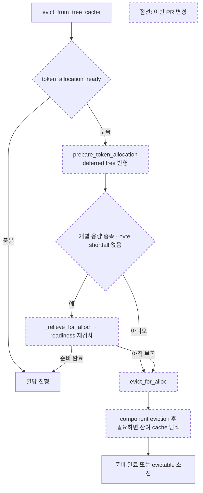

# Unified Joint Allocation 코드 및 PR 리뷰

- 리뷰 일자: 2026-09-11
- 대상 브랜치: `fix/unified-joint-allocation`
- 대상 HEAD: `139f789ea89d3809b28cd0d716f4804f4c68414e`
- 기준 커밋: `203d7e812c`
- PR 문서: [PR_UNIFIED_JOINT_ALLOCATION.md](PR_UNIFIED_JOINT_ALLOCATION.md)
- 검토 worktree: `/home/sukwoo24/sglang-eval-worktrees/unified-joint-allocation`
- 범위: 해당 브랜치의 3개 커밋, 변경 파일 7개, PR 설명. Inkling checkpoint 브랜치는 제외했다.

## 1. 변경 이해

- allocator가 FULL·SWA 개별 용량과 joint 용량을 함께 검사한다.
- cache는 최초 component shortfall을 채운 뒤에도 전체 할당이 불가능하면 eviction을 계속한다.
- byte lower bound로 성공할 수 없는 layout recovery를 건너뛴다.
- tri-pool의 고정 4회 retry를 공통 recovery 경로로 대체하고, decode gate에서도 전체 readiness를 검사한다.



핵심은 cache가 공유 메모리 배치를 계산하지 않고 allocator의 판단을 따른다는 점이다. 기존 component eviction 정책을 먼저 적용하고, 그것만으로 해결되지 않는 joint shortage를 추가 탐색으로 처리한다. `allocation_ready` callback은 단순 조회뿐 아니라 allocator-owned reclaim을 준비할 수 있다.

## 2. 적용한 리뷰 기준

다음 스킬과 해당 브랜치의 contribution guide, PR template, `test/README.md`를 참고했다.

- `sglang-unified-memory`: 공유 byte pool, component/joint capacity, ID와 byte 부족의 구분, float 이동, deferred reclaim, 실제 할당 및 payload 검증 기준.
- `sglang-humanize-review`: 실제 maintainer 리뷰 코퍼스와 변경 실행 경로를 바탕으로 correctness, lifetime, hot-path 비용, 검증 근거를 검토.
- `sglang-contribution-workflow`: 변경 범위, 회귀 테스트, PR template, 재현 가능한 정확도·성능 근거, 검증 상태의 정직한 표시.
- `sglang-interface-style`: optional capability의 명시적 계약, wrapper 전달, shortfall과 quota의 의미 보존.

Humanize 코퍼스는 **40,110개 스레드 전체를 검색해 36개 스레드·25개 PR, 68개 human comment**가 일치했다. 변경된 7개 경로와 `unified memory`, `eviction`, `allocation`, `deferred free`, `swa`, `mamba` 키워드를 사용했다. 이후 eviction 관련 `pr_conversation`도 별도로 확인했다.

반복되는 리뷰 기준은 실제 할당 성공, lock/lifetime 보존, 다른 cache 경로와의 호환성, 재현 가능한 성능 근거였다. 예를 들어 [PR #11313](https://github.com/sgl-project/sglang/pull/11313#discussion_r2422325363)은 allocation/eviction 책임 경계를, [PR #28161](https://github.com/sgl-project/sglang/pull/28161#discussion_r3415074722)은 locked component 보존을 다뤘다. [PR #6907](https://github.com/sgl-project/sglang/pull/6907)은 cache 최적화의 재현 방법과 다른 cache 구현과의 호환성을 요구했다. 이 자료는 리뷰 관점의 근거이며, 현재 패치의 버그를 입증하는 대체 증거로 사용하지 않았다.

## 3. 리뷰 판정

**설계 방향은 적절하고 Draft PR로도 적절하지만, 현재 merge 승인은 보류한다.**

확정한 신규 P0/P1 코드 버그는 없다. 다만 새 recovery API에 남은 회복 가능성 판단의 빈틈, 미해결 동시 출력 차이, benchmark 재현 자료 접근성은 보완해야 한다. 아래 구현 항목은 새로 도입된 회귀로 확정한 문제가 아니라 이번 수정 범위에 남은 한계로 구분한다.

## 4. 코드 및 PR 보완 사항

### 4.1 [P2 · 구현 범위의 빈틈] float 이동으로 해결 가능한 component 부족을 recovery 전에 차단

위치: [unified_hybrid_swa.py:245](/home/sukwoo24/sglang-eval-worktrees/unified-joint-allocation/python/sglang/srt/mem_cache/allocator/unified_hybrid_swa.py:245), 대상 HEAD 기준.

```python
if (
    self.full_available_size() < num_tokens
    or self.swa_available_size() < num_tokens
):
    return False
```

`full_available_size()`는 float 반대편의 여유 공간을 이동으로 확보할 가능성까지 포함하지 않는다. 따라서 이 값이 부족하다는 사실만으로 recovery를 생략하면 불필요한 eviction이 발생할 수 있다.

기존 `TestUnifiedTriPool._build()` fixture에서 `n_full=32`, `n_swa=24`, `n_state=8`로 pool을 만들고, composite 4 tokens를 할당해 float를 배치한 뒤 FULL 쪽 band의 여유를 2 pages까지 줄였다. **Eager/lazy 양쪽에서 다음 결과를 재현했다.**

| 상태 또는 동작 | 결과 |
|---|---:|
| 요청량 | 6 tokens |
| FULL / SWA / joint 가용량 | 2 / 20 / 2 |
| byte shortfall | 0 |
| `prepare_token_allocation(6)` | `False` |
| 직접 `_relieve_for_alloc(allocator, 6)` | `True` |
| recovery 후 FULL / SWA / joint 가용량 | 9 / 20 / 15 |
| 이후 실제 `alloc(6)` | 성공 |
| `verify_byte_accounting()` | `[]` |

같은 초기 배치에 실제 `UnifiedRadixCache`를 연결하고 최초 composite allocation을 4-token prefix로 삽입하면, `evict_from_tree_cache(cache, 6)`은 **이동만으로 보존할 수 있었던 prefix 4 tokens를 전부 제거**했다. 이후 할당과 byte accounting은 정상이다. 이는 CPU에서 확인한 불필요한 eviction 사례이며, GPU 데이터 손상이나 serving 성능 회귀를 입증한 결과는 아니다.

**분류상의 주의:** 기존 component-first 정책에도 존재하는 한계이며, 이번 PR이 새로 만든 회귀로 확정하지 않았다. 다만 새 recovery API가 complete feasibility를 설명하는 범위에 비해 실제 준비 경로는 제한적이다.

권고:

- 실제 ID 한도 부족과 이동으로 해결할 수 있는 byte/band 부족을 구분한다.
- 물리 배치 이동의 가능성을 판단할 때 component capacity가 부족하다는 이유만으로 recovery를 차단하지 않는 방안을 검토한다. 이동 gate와 ID 제한은 계속 보존해야 한다.
- 실제 할당 성공뿐 아니라 보존 가능한 prefix가 eviction되지 않았음을 검사하는 회귀 사례를 추가한다.
- 의도적으로 범위 밖에 둘 경우 PR 설명에 한계를 명시하고 후속 항목으로 분리한다.

### 4.2 [Merge 검증 보류] 동시 출력 차이의 원인이 분리되지 않음

위치: [PR_UNIFIED_JOINT_ALLOCATION.md:49](/home/sukwoo24/sglang/PR_UNIFIED_JOINT_ALLOCATION.md:49).

PR 문서에 따르면 버전 내부에서는 안정적이지만 B/C 사이에서 달라지는 요청이 Kimi mixed에서 67개 존재한다. 같은 버전에서도 출력이 비결정적이라는 사실만으로 이 차이를 해소할 수는 없다.

반대로 Kimi는 SWA byte guard를 직접 실행하지 않으므로 이를 곧바로 패치의 correctness 버그로 단정할 수도 없다. 동일 입력·동일 batch 구성으로 최초 divergence를 좁혀 패치 영향과 실행 조건 차이를 분리해야 한다. source/import 경로, prerequisite, 실제 설정을 manifest로 비교할 수 있어야 한다.

문서가 출력 차이와 latency 문제를 숨기지 않고 Draft로 남긴 판단은 적절하다. 이 항목은 문서에 기록된 미해결 검증 사항에 대한 리뷰이며, 이번 리뷰에서 serving 결과를 다시 측정하거나 해당 숫자를 독립 검증하지 않았다.

### 4.3 [P2 · PR 재현성] benchmark manifest와 실행 스크립트 접근 경로 누락

위치: [PR_UNIFIED_JOINT_ALLOCATION.md:68](/home/sukwoo24/sglang/PR_UNIFIED_JOINT_ALLOCATION.md:68).

본문은 정확한 command와 budget이 manifest에 있다고 설명하지만 링크를 제공하지 않는다. 변경된 7개 파일에도 해당 자료는 포함되지 않는다. 따라서 외부 reviewer가 matrix와 serving 결과를 재현하기 어렵다.

최소한 다음 자료를 접근 가능한 artifact로 연결할 것을 권고한다.

- allocator/cache matrix 실행 스크립트 및 valid/impossible case 판정 기준.
- 모델 revision, 실제 byte budget, server/client command를 포함한 manifest.
- Inkling prerequisite 커밋과 로컬 모델 생성 방법.
- 출력 비교 및 pair별 측정 결과.

대규모 원시 로그를 코드 PR에 포함할 필요는 없다. 별도 artifact 링크와 핵심 재현 command면 충분하다.

## 5. 적절하다고 평가한 구현

- **명시적 optional capability:** `TokenAllocationRecovery | None` 계약은 backend를 추측하는 `getattr` fallback보다 명확하다.
- **책임 경계:** allocator가 feasibility와 movement를 소유하고 cache는 victim 탐색을 담당한다. TreeCore에 allocator layout 계산을 추가하지 않는다.
- **의미 보존:** allocation shortfall과 명시적 count-based eviction quota를 구분한다.
- **Wrapper 전달:** `StreamingSession.evict_for_alloc()`이 readiness callback을 전달하고, callback이 없는 기존 호출 형태도 보존한다.
- **Deferred reclaim:** queued free를 allocator에 반영한 후 readiness를 다시 검사하며 기존 free-group scope를 복원한다.
- **기존 recovery 재사용:** 별도의 이동 구현 대신 `_relieve_for_alloc()`을 사용한다.
- **Byte lower bound:** 이를 readiness의 증명으로 사용하지 않고 실패가 확실한 recovery를 생략하는 하한으로 사용한다. tri-pool state의 live bytes도 포함한다.
- **충분한 용량의 fast path:** `evict_from_tree_cache()`는 readiness가 이미 충족되면 preparation 없이 반환한다.

이 평가는 source-level 구조와 실행한 CPU 테스트에 근거한다. GPU concurrency, pending reuse, 실제 live payload 이동 안전성 전체를 새로 검증했다는 의미는 아니다.

## 6. PR 문서 평가

제목과 Motivation / Modifications / Accuracy Tests / Speed Tests and Profiling / Checklist 구성은 repository template에 맞는다.

특히 다음 구분은 적절하다.

- B/C는 byte guard 비교이며, A/C는 headroom에서만 전체 패치 비교라는 점.
- rebase 이후 CPU 테스트와 rebase 이전 GPU 측정의 구분.
- exact sequence equality와 task accuracy의 구분.
- recovery attempt 감소와 실제 inference speedup의 구분.
- 3개 pair의 통계적 불확실성과 unresolved latency 결과.
- 로컬 검증과 upstream CI/approval의 구분.

다만 긴 측정 내역은 연결된 artifact로 옮기고 본문에는 최소 실패 사례, 핵심 결과, 미해결 항목을 남기면 읽기 쉽다. 예를 들어 FULL=4, SWA=4, joint=3인 상태에서 4-token allocation이 component 검사만으로는 해결되지 않는 사례를 Motivation에 넣으면 문제를 빠르게 이해할 수 있다.

전체 패치의 pressure 조건 A/C serving 효과는 현재 B/C 결과로 대체할 수 없다. 문서가 이미 이 제한을 밝히고 있으므로 잘못된 주장으로 분류하지 않지만, reviewer가 전체 패치의 효과로 오해하지 않도록 이 구분을 유지해야 한다.

## 7. 직접 실행한 검증

실행 위치: `/home/sukwoo24/sglang-eval-worktrees/unified-joint-allocation`

Python 환경: `/home/sukwoo24/.venv_sglang_upstream_full/bin/python`, PyTorch `2.13.0+cu130`.

```bash
PYTHONPATH=python /home/sukwoo24/.venv_sglang_upstream_full/bin/python -m pytest -q \
  test/registered/unit/mem_cache/test_multi_ended_allocator.py \
  test/registered/unit/mem_cache/test_unified_radix_allocation_eviction.py \
  test/registered/unit/mem_cache/test_unified_tri_pool.py \
  test/registered/unit/mem_cache/test_unified_joint_allocation_eviction.py

SGLANG_UNIFIED_RADIX_TREE_CORE_BACKEND=rust PYTHONPATH=python \
  /home/sukwoo24/.venv_sglang_upstream_full/bin/python -m pytest -q \
  test/registered/unit/mem_cache/test_unified_joint_allocation_eviction.py

git diff --check 203d7e812c..139f789ea8
git range-diff 2092f6df05..f847119926 203d7e812c..139f789ea8
```

`diff --check`는 실행 당시 동일한 base/head를 가리킨 `upstream/main...HEAD` 형식으로 실행했다. 위에는 재현 시 ref 이동의 영향을 피하도록 고정 revision으로 표기했다.

| 검증 | 직접 관측한 결과 |
|---|---|
| Focused CPU suite | **161 passed, 111 subtests passed**, 20.62초 |
| Rust TreeCore 회귀 파일 | **12 passed, 24 subtests passed**, 56.65초 |
| `git diff --check` | 통과 |
| Rebase 전후 `git range-diff` | 3개 커밋 모두 동일 패치로 표시 |
| 추가 float recovery 사례 | Eager/lazy 모두 preparation의 false negative와 불필요한 eviction 재현 |

테스트에는 `asyncio_mode` 미인식 경고와 SWIG/Torch deprecation 경고가 있었지만 실패는 없었다.

이번 리뷰에서 GPU allocator/cache matrix, GPU serving, 출력 parity, 성능 실험, pre-commit은 재실행하지 않았다. 이들에 대한 PR 문서의 수치는 작성자의 기록으로 취급했다. 테스트 통과만으로 미해결 동시 출력 차이나 latency 문제를 해소했다고 판단하지 않는다.

## 8. 후속 권고

1. Float 이동만으로 해결 가능한 component 부족을 현재 PR에 포함할지 결정하고, 구현 또는 범위 설명에 반영한다.
2. Benchmark script와 manifest를 reviewer가 접근 가능한 artifact로 연결한다.
3. 동시 출력 차이와 latency 결과의 원인을 분리한 후 merge readiness를 다시 판단한다.
4. 최종 submission head에서 필요한 formatting, 관련 GPU 검증, upstream CI 및 reviewer approval을 완료한다.

리뷰 과정에서는 대상 코드, 기존 PR 문서, 커밋을 변경하지 않았다. 이 Markdown 파일은 완료된 리뷰를 기록한 문서다.
