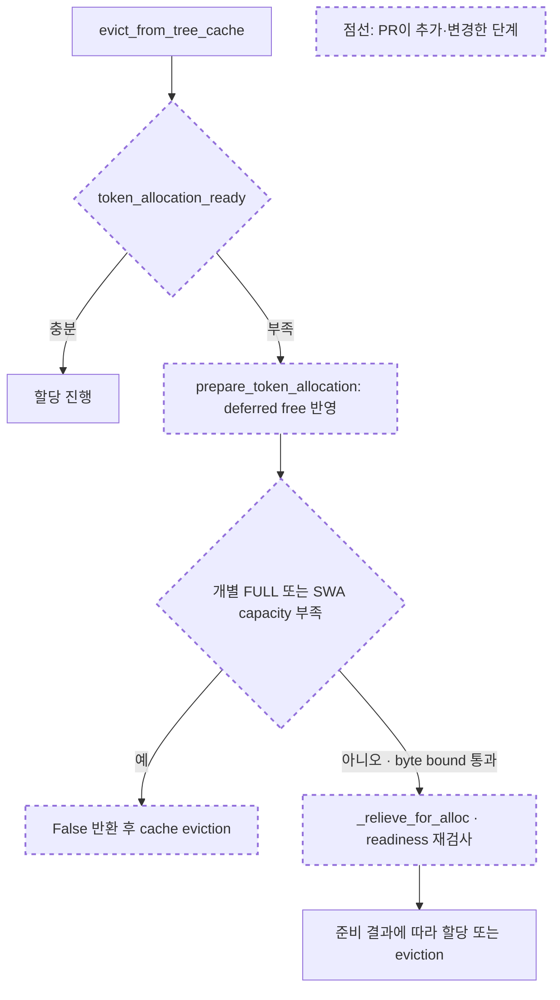

# 기존 리뷰 확인 및 독립 재현

대상: `REVIEW_UNIFIED_JOINT_ALLOCATION.md`, 현재 패치 HEAD `139f789ea89d3809b28cd0d716f4804f4c68414e`, base `203d7e812c`. 2026-09-11 확인. 원문 리뷰의 대상과 실제 worktree HEAD가 일치한다.

## 패치 이해

- `evict_from_tree_cache`는 allocator의 complete readiness와 preparation을 먼저 확인한다.
- `prepare_token_allocation`은 deferred free를 반영하지만 FULL/SWA 개별 capacity가 부족하면 layout recovery 전에 반환한다.
- 이 반환 후 cache eviction이 실행될 수 있다. 이번 확인은 float 이동으로 회복 가능한 상태를 그 조건이 배제하는지 검증했다.



진입점은 cache eviction helper다. 수정된 preparation은 deferred free를 먼저 반영하지만, 개별 capacity가 부족하면 float 이동을 시도하는 `_relieve_for_alloc`까지 도달하지 않는다. 재현에서는 이 분기가 실제 이동 가능성을 놓치고 eviction을 선택했다. 그림은 해당 쟁점에 필요한 분기를 축약한 것이다.

## 과거 리뷰 관점

Humanize 코퍼스 전체 40,110개 스레드를 변경 파일 7개 및 `unified memory`, `eviction`, `deferred free`로 검색해 6개 스레드/5개 PR/15개 human comment를 확인했다. 이어 eviction 관련 PR conversation #5556, #6907을 읽었다. 원문 리뷰와 검색어가 다르므로 일치 건수는 서로 직접 비교하지 않는다.

반복된 기준은 allocation/eviction의 책임 경계, locked component의 수명 보존, hot path 비용, 다른 cache 경로의 호환성, 재현 가능한 성능 근거였다. 특히 “더 적게 evict한다”는 사실만으로 serving 성능 개선을 결론 내릴 수 없고, 실제 실행 비용까지 검증해야 한다. 이 관점은 확인 범위를 정하는 데 사용했고 현재 결함의 근거는 아래 재현과 코드다.

## 1. Float recovery 지적: 동의, 현재 HEAD에서 독립 재현

위치: [unified_hybrid_swa.py:246](/home/sukwoo24/sglang-eval-worktrees/unified-joint-allocation/python/sglang/srt/mem_cache/allocator/unified_hybrid_swa.py:246).

기존 `TestUnifiedTriPool._build(n_full=32, n_swa=24, n_state=8)` fixture를 사용했다. Composite 4 tokens를 할당한 후 FULL-only 할당으로 FULL 쪽 즉시 band 여유를 2 pages까지 줄였다. 동일한 초기 상태를 두 개 만들어 직접 layout recovery와 정상 eviction 경로를 각각 비교했다. Cache 경로에는 실제 `UnifiedRadixCache`를 사용했고 4-token prefix를 삽입했다.

| 관측 | Eager | Lazy |
|---|---:|---:|
| 요청량 | 6 | 6 |
| 초기 FULL/SWA/joint | 2/20/2 | 2/20/2 |
| Byte shortfall | 0 | 0 |
| `prepare_token_allocation(6)` | False | False |
| 직접 `_relieve_for_alloc(..., 6)` | True | True |
| 직접 recovery 이후 FULL/SWA/joint | 9/20/15 | 9/20/15 |
| 직접 recovery 후 보존된 prefix tokens | 4 | 4 |
| 정상 helper eviction 후 보존된 prefix tokens | 0 | 0 |
| 양쪽 경로의 실제 `alloc(6)` | 성공 | 성공 |
| 양쪽 경로의 byte accounting | 위반 없음 | 위반 없음 |

직접 recovery/추가 allocation 이후, fixture의 FULL/SWA marker를 각각 가상 ID로 조회해 기존 4-token 값 보존도 확인했다. 이는 CPU fixture의 fake KV storage를 이용한 이동 확인이다. 실제 GPU tensor/kernel 또는 serving payload 안전성을 입증한 실험으로 확대 해석하지 않는다.

**판정:** 현재 capacity가 부족하다는 사실과 이동 후에도 할당할 수 없다는 사실을 구분하지 않은 preparation의 한계가 확인된다. 원문의 P2/불필요한 eviction 분류에 동의한다.

B `9b260b39ef`에도 동일한 조기 반환 조건이 있음을 source에서 확인했다. 따라서 byte guard 추가로 새로 생긴 회귀라고 주장할 근거는 없다. 이번 재현에서 upstream A를 실행해 비교한 것은 아니므로 전체 패치의 최초 도입 시점에 관한 새 회귀 판정도 하지 않는다.

권고는 이번 PR에서 보완하는 것이다. 단순히 guard를 삭제하기보다 conservation/ID 한도와 회복 가능한 band 부족을 분리하고, byte 하한·기존 move/event gate를 보존해야 한다. 회귀 테스트는 할당 성공뿐 아니라 prefix 보존, 실제로 부족한 ID, 불가능한 byte budget, locked/exhausted cache를 함께 확인하는 방향이 적절하다.

## 2. 동시 출력 차이: merge 검증 보류에 동의

기존 `output-repeat-analysis.json`에 Kimi mixed의 안정적인 버전 간 차이 67개 요청/38개 고유 입력이 기록되어 있고 PR 본문과 일치한다. 저장 요약과 source 경로를 확인했으며 이번 확인에서 원시 요청 전체 비교나 GPU serving을 다시 실행하지 않았다.

Kimi는 SWA byte guard를 직접 사용하지 않는다. 따라서 4.1의 float 문제를 고쳐도 Kimi 출력 차이나 latency 증가의 원인이 해소됐다고 말할 수 없다. 고정 batch/입력/순서로 최초 divergence를 찾고 import/source/prerequisite/설정 차이를 분리해야 한다. 기존 같은 버전 반복에서 변동이 있다는 사실은 면책 근거가 아니다.

## 3. 재현 자료 링크: 동의

현재 PR 본문은 정확한 명령과 budget이 manifest에 있다고 설명하지만 외부 reviewer가 접근할 artifact 링크가 없다. 이 부분은 실제 문서 누락이다. 로컬 자료는 다음 위치에 있으나 로컬 경로만 PR에 붙이는 것으로 외부 접근성이 해결되지는 않는다.

- `/home/sukwoo24/sglang-eval-worktrees/unified-allocation-artifacts/strict-resume-20260910/`
- `source-manifest.json`, `confirmation-manifest.json`, `third-repeat-manifest.json`
- `server_runner.py`, `run_queue.py`, `report_confirmation.py`, `analyze_final.py`
- `extended-confirmation-report.json`, `output-repeat-analysis.json`, 각 run의 manifest

Matrix runner/판정 기준과 Inkling 구성 방법도 함께 묶어 공개 가능한 artifact 및 재현 command로 연결하는 것이 적절하다. 이번 확인에서는 업로드하거나 GitHub에 게시하지 않았다.

## 확인 범위와 다음 순서

1. Preparation의 회복 가능성 판단을 보완하고 prefix 보존 회귀 사례 추가.
2. Benchmark 재현 자료를 정리하고 PR에서 접근 가능하게 연결.
3. 동시 출력/latency 원인을 별도로 좁힌 뒤 최종 head 검증 및 merge readiness 재판단.

원문의 “설계 방향은 적절하지만 merge 승인은 보류”라는 결론에 동의한다. 이번 확인으로 4.1에 독립 CPU 재현 근거를 추가했으며, 전체 suite/GPU/성능을 새로 통과했다고 주장하지 않는다. Production 코드, 기존 리뷰, PR 본문과 커밋은 수정하지 않았다.

재현 명령:

```bash
/home/sukwoo24/.venv_sglang_upstream_full/bin/python /tmp/verify_joint_review_float.py
```

- [재현 스크립트](/tmp/verify_joint_review_float.py)
- [Eager/lazy 결과 JSON](/tmp/verify_joint_review_float.json)
- [코퍼스 검색 결과](/tmp/joint-review-followup-corpus.txt)

첫 실행은 sandbox의 외부 캐시 로그 쓰기에 막혔다. 권한을 받은 뒤 fixture의 필수 인자 누락을 수정하고 최종 실행을 완료했다. 최종 성공 결과만 위 표에 사용했다. `git diff --check 203d7e812c..139f789ea8`도 통과했고 대상 worktree는 깨끗하다.
