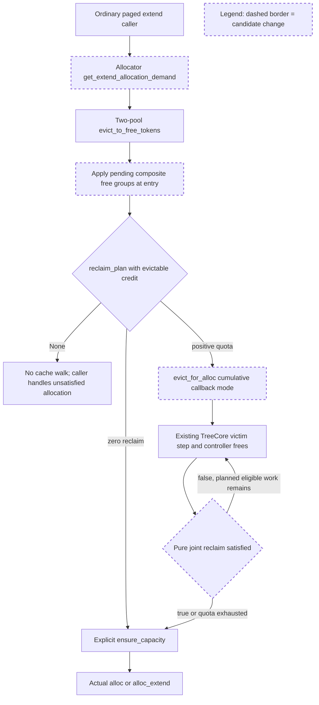

# Two-pool candidate acceptance review

**Decision: APPROVED — 승인된 isolated two-pool 구현 및 CPU 검증 작업을 수용한다.**

**현재 검토 범위에서 필수 수정 사항은 없다.** 이 결정은 #39294 전체 merge-ready 판정, tri-pool 대체 승인 또는 GPU/remote 작업 승인과 구별된다.

- Reviewer session: `01a09f85-77de-79d1-a50d-cb7a530616c1`
- Review date: 2026-09-14 (Asia/Seoul)
- Candidate worktree: `/home/sukwoo24/sglang-eval-worktrees/review-joint-candidate`
- HEAD/base: `6c8bbdf610fae5a3ddba826162bc7ca91e79dbfb`
- Reviewed report: `CANDIDATE_REVIEW.md`
- **Report SHA256: `508022ff54d40cb62a195b0a53c5853948dc7a0aa952c66ea43e278a73dbf8fb`**
- **Accepted patch SHA256: `cfc5b3c6c2593189b5a1c15a3f5b774eba55d19a1813d32013de0f68ec6cd2bf`**

승인은 위 frozen base와 해당 staged patch 조합에 적용한다. 이후 변경한 patch나 rebase에 자동으로 이어지는 승인은 아니다.

## 구현 이해

- `allocation.py:188–201`은 allocator-owned extend-demand hook을 사용한다. 기본 구현은 기존 conservative demand를 반환하고, concrete two-pool allocator만 unsharded 일반 extend에 정확한 CPU page rounding을 사용한다.
- `unified_hybrid_swa.py:1107–1134`의 two-pool eviction 경로는 entry deferred drain → 기존 planner → cumulative reclaim walk → explicit ensure 순서를 갖는다. tree에 전달하는 callback은 evictable credit 없는 `reclaim_plan(n, n) == (0, 0)`이다.
- `unified_radix_cache.py:611–635`의 callback mode는 기존 component availability target 생성을 우회한다. allocator-visible controller free 이후 순수 joint 조건을 검사하며, planner quota나 victim exhaustion 이후 전체 cache 재순회를 추가하지 않는다.

정확한 extend demand는 token 단위로 전달된다. cache는 allocator geometry를 계산하지 않고, 정해진 cumulative quota 안에서 실제 reclaim을 수행한다. callback true는 추가 eviction이 불필요하다는 뜻이고 실제 allocation은 여전히 allocator의 ensure와 최종 할당으로 확인한다. callback 없는 기존 shortfall 및 count 경로는 기존 의미를 유지한다.

## 독립 검토 및 증거 범위

manifest의 patch와 5개 log/proof 파일 hash가 모두 일치했다. 현재 `git diff --cached --binary`의 SHA256도 제출 patch와 일치했다. worktree는 6개 production Python 파일과 1개 신규 test 파일의 staged 변경이며, 확인한 unstaged diff는 없었다. HEAD는 제출한 frozen #36729와 일치한다.

SGLang Unified Memory, Humanize Review, Contribution Workflow, Interface Style 기준으로 actual staged diff와 caller/callee, TreeCore component walk, wrapper, test fixture를 읽었다. Humanize corpus 전체 40,110 threads를 이번 변경 경로 및 `eviction / locked / compaction`으로 sweep하여 2 threads / 2 PRs를 확인했고, conversation sweep에서는 137 threads / 137 PRs를 확인했다. [locked peer invariant review](https://github.com/sgl-project/sglang/pull/28161#discussion_r3415074722)와 [suffix lifecycle discussion](https://github.com/sgl-project/sglang/pull/26907#issuecomment-4599481920)의 반복된 기준인 실제 survivor, live payload, cascade 이후 상태를 중심으로 검토했다.

검토자는 CPU/GPU tests를 재실행하지 않았다. 아래 수치는 hash가 확인된 제출 로그 및 harness JSON의 관측값이며, 독립적인 source/test 검토와 함께 수용한다.

## 수용한 동작과 계약

1. **two-pool 과잉 eviction:** demand 3/4/6/90, page 1/4/16, eager/lazy에 대해 실제 allocation과 96/95/93/9 survivor의 deterministic key 및 virtual-ID 집합을 검사한다. prefix payload를 단순 count와 별도로 확인한다. 기존 Stage A의 6-page/90-page 과잉 eviction이 해결된 근거로 충분하다.
2. **callback 순수성:** production callback은 planner의 zero-credit query만 수행한다. preparation/group drain을 callback에 넣지 않았다. 새 test는 nonempty group의 contents, v2p/p2v, holes, frontiers, live count를 독립 값으로 snapshot하여 open/closed gate 반복 조회와 비교한다.
3. **quota와 shortfall 분리:** callback mode는 `available_size_targets`를 만들지 않고 `_evict`의 누적 tracker를 그대로 사용한다. FULL/SWA component는 `tracker[ct]`와 `evict_device_start`에 전달된 원래 cumulative target을 비교하므로 preceding cascade를 다시 차감하지 않는다. tree의 atomically evicted leaf/cascade 때문에 마지막 count가 quota를 넘을 수 있다는 기존 한계는 남는다.
4. **first sufficient reclaim:** internal SWA step이 `node_id=None, made_progress=True`를 반환하고 controller free 후 첫 만족 지점에서 끝나는 실제 fixture를 확인했다. 다음 independent leaf의 key/virtual ID/K/V가 실제 allocation 이후에도 보존된다. 이 frozen source의 SWA walker는 내부 reclaim을 하면 즉시 `None`으로 반환하며 같은 호출에서 다음 leaf까지 선택하지 않는다. 따라서 현재 loop가 leaf 이전의 별도 추가 predicate 호출을 넣지 않은 것을 이 범위의 결함으로 판단하지 않는다. 이후 TreeCore step 계약이 바뀌면 재검토해야 한다.
5. **deferred frees:** entry boundary에서 기존 `_flush_deferred_free_group`을 재사용한다. ordinary/representative groups뿐 아니라 실제로 FULL-only pending free가 없으면 부족한 사례도 검사한다. group scope 종료 후 명시적인 cleanup과 byte accounting이 포함된다.
6. **exact extend:** hook은 concrete two-pool class에만 있으며 shared base와 tri는 base default를 유지한다. caller의 400-probe/396-exact trap, partial page, zero-new-page, mixed prefix lengths, page boundary를 actual Python allocation path로 검증한다. sharded demand 보존은 dispatch 수준의 검증이고 DCP/DSV4 e2e 검증은 아니다.
7. **impossible demand 및 ID:** impossible paired-byte demand와 locked prefixes는 cache를 보존하며 allocation에 실패한다. asymmetric SWA restore case는 물리 bytes/pages와 독립적인 FULL-owner virtual namespace 한계를 검사한다. 이를 모든 paired-demand의 독립 ID-only eviction case를 실행한 결과로 확대하지 않는다.
8. **decode/session/rank:** 실제 `ScheduleBatch.check_decode_mem`이 기존 requests/spec_algorithm 인터페이스를 통과하고 예상 allocation/survivor를 만든다. Python active session cursor와 wrapper 경로를 검증했다. rank checker는 closure 주소를 제외하고 cache quota/callback presence와 allocator의 numeric demand/result를 비교한다. enabled-mode trace test는 이 변경의 주소 기반 false divergence를 검증하지만 실제 multi-rank 통신 실행을 대신하지 않는다.

### 별도 진입점 선호와 현재 API의 수용

Stage B 추가 절에서는 `evict_for_reclaim`이라는 별도 진입점을 선호했다. 실제 후보는 `evict_for_alloc(..., allocation_reclaim_satisfied=...)`를 유지하며 callback 유무로 명시적인 cumulative mode를 선택한다.

이번 actual diff 검토에서는 **이 구현 형태도 수용한다.** callback keyword가 호출부에 드러나고, base와 concrete docstring이 cumulative 의미를 정의하며, 구현은 callback mode를 availability-target 경로와 분리하고, 미지원 base-cache 사용은 fail-fast한다. 기존 callers는 callback 없는 경로를 유지한다. 별도 이름으로 바꾸는 것만을 이번 CPU 후보 수용의 필수 수정으로 요구하지 않는다. 이 판단은 앞선 선호 API를 현재 patch에 한해 명시적으로 완화하는 결정이며, 단위·순수성·bounded walk 계약을 완화하는 것은 아니다.

## 검증 결과의 정확한 해석

| 자료 | 확인한 결과 및 범위 |
| --- | --- |
| `candidate-new-python-final.log` | 14 passed, 39 subtests passed |
| `candidate-new-rust-final.log` | 13 passed, 39 subtests passed, 1 session-cursor test deselected |
| `rust-extension-proof.txt` | 실제 fingerprinted Rust extension `.so` 경로와 CUDA devices=0 |
| `candidate-cpu-suite-2.log` | 196 passed, 1,392 subtests passed, 8 skipped 및 초기 신규 fixture의 13 failed가 함께 남아 있음 |
| `candidate-precommit-final.log` | 최종 all-files pre-commit hooks PASS |
| candidate comparison JSON | main 45 rows 중 잔여 3 FAIL은 기존 tri/static-cap-contract 사례; edges 11 rows 중 잔여 4 FAIL은 기존 tri 사례 |

통합 CPU 로그 전체가 green인 것은 아니다. 기록상 기존 tests의 196 PASS와, fixture 수정 후 별도 실행한 신규 Python/Rust 최종 PASS를 합쳐 판단한다. 제출 보고서는 이 구분과 초기 fixture setup 실패를 이미 공개하고 있으므로 숨겨진 test failure로 판단하지 않는다. 실패했던 전체 suite를 이름만 바꿔 PASS라고 보고해서는 안 된다. 최종 신규 test setup 변경 때문에 기존 196 tests까지 무조건 다시 실행하도록 요구하지는 않는다.

Rust adapter는 이 frozen SHA의 `adapter.py:306`에서 session-radix-cache를 명시적으로 거절한다. 해당 1 test를 Rust에서 제외하고 Python에서 검증한 처리를 수용한다. Rust session support를 이 후보에서 구현할 필요는 없다.

`strict_temporal_live.py`는 반드시 남아야 하는 request-owned KV와 state `[3,4]`를 사전에 정하고 mapping 소실을 실패로 처리한다. 세 frozen comparison arm × eager/lazy의 6개 JSON에서 required state와 KV 보존을 확인했다. 이전 temporal 검증의 공허함을 보완하는 증거로 수용한다. 이 별도 자료는 tri END-only oracle의 completeness 또는 후보 GPU 안전성 증거는 아니다.

## 남은 한계와 후속 범위

아래는 이번 two-pool CPU 수용을 막는 필수 수정 사항이 아니며, 더 넓은 PR/production 수용과 구분해 계속 기록해야 한다.

- candidate-specific pending-reuse event transition 아래의 predicate/ensure 관계와 실제 GPU movement/event/graph ordering은 미검증이다. 기존 allocator event tests가 통과해도 이 경로 전체의 GPU 안전성을 보증하지 않는다.
- tri production delta와 float relocation/page-grid oracle의 completeness는 미완료다. 기존 tri 실패를 unchanged로 보존한 것과 tri 문제가 해결된 것은 다르다.
- DCP/DSV4/sharded exact-extend e2e, 실제 distributed rank-consensus 실행과 serving 성능은 이번 검증 범위 밖이다. instrumented CPU counters를 latency/throughput 개선으로 변환하지 않는다.
- cumulative callback mode의 zero-quota true/false, forced false at quota exhaustion, asymmetric cascade quota 등 모든 API corner를 각각 독립된 신규 test로 분리하지는 않았다. 현재 구현의 해당 종료/계수는 기존 TreeCore quota 경로와 source inspection으로 확인했다. 이후 이 loop를 변경한다면 focused contract tests를 우선 보강할 가치가 있다. 이를 새로 발견된 재현 결함으로 보고하지 않는다.
- test setup은 CPU device를 지정하지만 model config resolution과 외부 Python dependencies는 필요하다. 로컬 cached config 기반 실행을 완전히 offline/무의존 CI 검증이라고 표시하지 않는다.

## 권한 및 최종 결론

**승인된 two-pool local 구현과 CPU 검증 작업은 완료로 수용한다. 추가 필수 수정이나 재실행 요구는 없다.** patch와 로그를 이 상태로 보존하고 원래 #39294 대응의 부분 결과로 사용할 수 있다.

이 문서는 GitHub push/comment/review, 제출 branch rewrite, PR close, GPU/serving 실행 또는 tri production 변경을 새로 승인하지 않는다. tri CPU 탐색은 이전 Stage B 승인 범위 안에서 계속할 수 있고, production delta는 구체적인 별도 검토를 거쳐야 한다. #39294 전체 대응이나 #36729와의 integration/maintainer coordination은 아직 완료됐다고 선언하지 않는다.

검토자가 이번에 작성한 파일은 `CANDIDATE_ACCEPTANCE.md`뿐이다. source/test 수정, candidate 실행, stage 변경, commit 또는 remote mutation은 수행하지 않았다.
