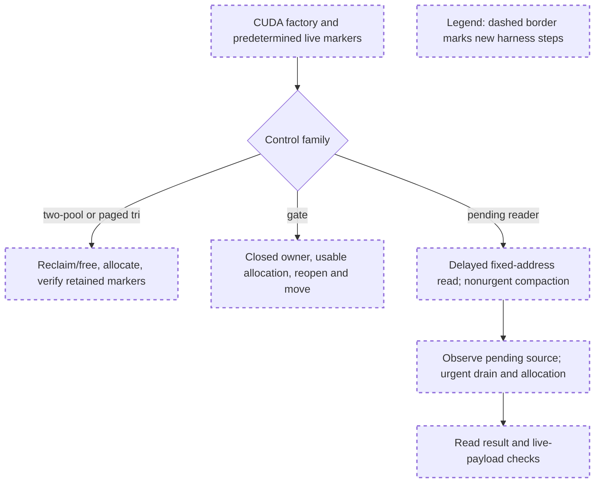

# Remaining GPU controls review

Reviewed `gpu_joint_extra_validation.py`, SHA256 `125c11c550c274374d1cfcd16e13d2ef3be62d343c251ac0dfb491f59404eda3`, against CPU-accepted source tree `fe601ec6fc21ca0efc9c914385f9e3ffc77ccacf`.

## Comprehension

- Eight two-pool cases use actual CUDA factories and the existing prefix/payload checks at page sizes 1/4, in eager/lazy modes.
- Two paged tri controls allocate request-owned state and KV, free interior allocations, then check surviving data after a new allocation. They do not enable paged Mamba checkpoint caching.
- Three gate cases exercise an owner while closed, allocate, reopen and require copies. Two pending-reader cases move a live FULL page while a delayed reader still uses its original physical address, then drain and allocate.

The allocation controls check concrete retention/payload behavior. Gate and pending-reader controls additionally need observations covering the entire protected interval and a write that makes premature reuse detectable.

The exhaustive corpus sweep scanned 40,110 threads and matched 932 memory-cache threads across 339 PRs; a separate unified-cache conversation sweep matched 306 conversations across 306 PRs. Buffer ownership in #29421 and reproduced lifecycle regressions in #31902 reinforce checking the actual storage and dependency, rather than treating bookkeeping success as data-safety evidence. I also independently ran the non-GPU `ruff check --select F821` on this harness; it passed.

## Decision

**APPROVED for the eight two-pool and two paged-tri allocation controls. CHANGES_REQUESTED for the gate/pending validation details below before running the complete 15-row script as the proposed validation.** These are harness coverage defects, not findings against the accepted production implementation.

The approved allocation controls may run as an isolated selection. Two-pool retention is 95/9 prefix records (each a page), so page-size-4 results must not be described as 95/9 tokens. The paged tri cases correctly keep Mamba state request-owned and check nonempty temporal data. No other blocking fixture issue was identified in these ten controls.

## Required harness corrections

### 1. Make premature pending-source reuse observable

At lines 115–117, the harness drains, calls `a.alloc(4*ps)` and discards its result without writing the newly allocated storage. The old reader can still observe its original marker even if that source was incorrectly made allocatable early: allocation/remapping alone need not overwrite the data. A pending-count check plus an unchanged read does not prove safe reuse.

Retain the allocation result and enqueue a distinct marker write into the newly allocated FULL storage on the scheduler stream, before the final observation synchronization. Assert that this allocation really reuses the old source storage read by the outstanding reader, and check both the old reader's original marker and the new allocation's marker after completion. Use kernel IDs for data-address overlap; if inspecting `_pending_reuse_pages_cpu`, compare corresponding physical page IDs, not kernel-scaled token IDs. Confirm the protected moved source itself belongs to the pending set, not merely that some pending entry exists.

Do not bypass the allocator's dependency to force the overwrite. The marker write must naturally follow allocation on the stream carrying the production urgent-drain wait. Precompute/setup or enqueue overlap checks so no new host synchronization settles the reader before the competing allocation/write has been enqueued. If the fixture does not actually reuse the old source, report insufficient coverage rather than a reuse-safety PASS.

### 2. Observe the outstanding dependency at urgent drain

The `unfinished` sample at line 109 precedes the GPU-backed `torch.equal` assertion at line 114 and the urgent flush. The event can finish between them; line 120 would still report `event_unfinished=True` and PASS without exercising an unfinished-event drain.

Observe the real event at the relevant urgent `_drain_pending_reuse`/wait boundary with a non-synchronizing query, while preserving the original method call. Record that observation separately from pending creation. If the dependency is already complete there, retain the completed-event result but mark the unfinished-event subcase INCONCLUSIVE. Keep synchronization for setup/final inspection, not as a substitute for the production dependency.

### 3. Cover allocation inside the closed-gate observation

The copy wrapper at lines 73–76 ends before `a.alloc(1)` at line 78. Thus `closed_moves=0` does not cover the entire closed-gate interval claimed by the row. Extend the owner-copy observation through both explicit preparation and allocation, then assert zero owner copies. Continue requiring real reopened movement and preserved live payloads.

For `owner='mamba'`, joint token allocation does not test allocation of the gated Mamba member's own reusable storage. Allocate one state from the Mamba allocator under its closed gate, using existing hole/gap capacity, and track that returned state's marker through the later movement. Keep the FULL/SWA joint allocation for the other two cases. Preserve legal ownership and the predetermined remaining state/KV sets when creating the second interior hole.

## Execution authorization after corrections

**The concrete harness corrections above, a fresh non-GPU name check, and subsequent execution of the corrected 15-row harness are authorized within the existing lane. No additional preliminary approval request is required.** Preserve this submitted file/hash, publish the corrected harness under a new hash, and record exact source/command provenance. No production source change is authorized by these fixture corrections.

Run sequentially after v3, not in parallel, and do not proceed past a preceding CUDA error, timeout or material retention regression requiring a stop. Keep the existing one-process RTX 5090 scope, at least 4 GiB free, below-1-GiB fixture allocation budget and external 180-second timeout. Preserve INCONCLUSIVE cases rather than counting them as dependency coverage. No serving, model download, remote action, or merge-ready claim is included.

Only this review artifact was created. The reviewer inspected source and ran a static undefined-name check; no harness/source was modified and no GPU workload was executed.
