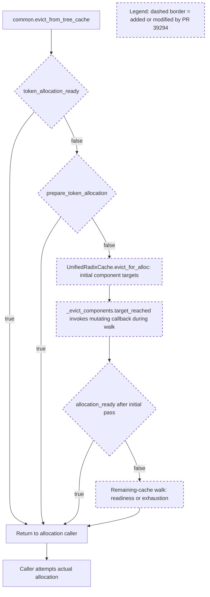

# PR #39294 plan review

**Decision: APPROVED — Stage A 실행과 Stage B 검토 자료 작성·제출에 한정.**

- Reviewer session: `01a09f85-77de-79d1-a50d-cb7a530616c1`
- Review date: 2026-09-14 (Asia/Seoul)
- Reviewed plan: `/home/sukwoo24/sglang-eval-results/pr39294-review-20260914/PLAN.md`, revision 1
- **Plan SHA256: `dd62c1e2eda2bc45388b3f0aaec52bd02e004928b7fd75f990250a7d1f452eec`**
- #39294 HEAD: `276771eefca951ae6d55608415f2d795cbfabdae`; base: `14b647cf27d7f2c1a3764841f7d3770ff9f9e7d6`
- #36729 HEAD: `6c8bbdf610fae5a3ddba826162bc7ca91e79dbfb`; base: `5200508b0fd25733752c2c5e3af5539508023c27`

이 문서는 지정된 reviewer session이 직접 내린 실질적인 승인이다. 요청 세션은 아래 조건을 적용하여 Stage A를 시작할 수 있으며, 이를 위해 별도의 재승인은 필요하지 않다. **Stage B의 구현 경로 승인, Stage C 구현, Stage D 후보 검증은 아직 승인하지 않는다.** PR 자체에 대한 merge 승인도 아니다.

## 변경 이해와 검토 근거

- #39294는 `common.evict_from_tree_cache`에서 FULL/SWA의 개별 용량 외에 전체 할당 가능 여부를 확인한다. `TokenAllocationRecovery`와 cache/session callback 전달이 이를 연결한다.
- 현재 callback은 순수 조회가 아니라 `prepare_token_allocation`이다. 이 함수는 deferred free를 적용하고 조건에 따라 recovery ladder를 실행한다. `UnifiedRadixCache.evict_for_alloc`은 초기 component 목표 이후에도 callback이 false이면 남은 cache를 순회한다.
- tri-pool의 기존 4회 재시도 override를 제거하고 공통 경로를 사용하며, decode에도 전체 용량 확인을 추가한다. 비교 대상 #36729는 two-pool에서 allocator-owned planning을 사용하지만 tri-pool에는 기존 재시도가 남아 있다.

초기 조회 또는 preparation이 성공하면 eviction을 건너뛴다. 실패하면 첫 eviction pass에서 component 목표를 따르면서 callback을 반복 호출하고, 전체 demand가 여전히 충족되지 않으면 남은 cache를 걷는다. 이 callback 내부에서 reclaim이 일어날 수 있다는 점이 C1/C5이고, 끝까지 false인 demand를 사전에 거르지 못하는 점이 C2다. eviction helper의 반환은 실제 할당 성공을 대신하지 않는다.

실제 PR SHA의 diff와 주변 코드를 `git show`로 확인했다. 검토 시 GitHub API에서도 두 HEAD/base와 5개 코멘트 ID 및 수정 시각이 저장 자료와 일치함을 확인했다. `reviews.json`의 유일한 review는 본문 없는 COMMENTED 상태다. 현재 `/home/sukwoo24/sglang` HEAD는 별도 revision이므로 이 checkout의 소스를 PR 근거로 대체하지 않았다.

Humanize corpus는 전체 40,110 threads를 독립적으로 sweep했다. 8개 변경 경로와 `joint allocation / compaction / locked` 조합은 2 threads / 2 PRs, 별도 `eviction / compaction` conversation sweep은 137 threads / 137 PRs였다. 전자는 lock과 cascade의 불변식, 후자는 suffix가 나중에 leaf로 변한 뒤의 보존과 재현 가능한 검증 자료를 강조한다. [#28161 lock review](https://github.com/sgl-project/sglang/pull/28161#discussion_r3415074722), [#26907 suffix lifecycle discussion](https://github.com/sgl-project/sglang/pull/26907#issuecomment-4599481920)의 핵심은 단순 eviction count보다 실제 살아 있는 데이터와 후속 동작을 확인하는 것이다. 이 선례는 검증 기준의 근거이며, 현재 PR의 결함을 대신 증명하지 않는다. 계획의 6-thread 결과와 다른 것은 독립 sweep의 query 구성이 다르기 때문이다.

## C1–C5 판단

| 코멘트 | 판단 및 대응 범위 |
| --- | --- |
| C1 | 분석에 동의. #39294 `common.py:174`, `unified_radix_cache.py:840`의 mutating callback은 확인된다. 그러나 `unified_hybrid_swa.py:241–257`에는 readiness, ID, byte guard가 있고 `unified_sub_pool.py:215`는 pending group이 없으면 반환한다. 제출된 CPU 결과의 87 victims / 92 prepare / 0 relief는 반복 preparation 호출을 보여 주며, 매 victim마다 실제 compaction했다는 증거는 아니다. 순수 predicate와 명시적 recovery 경계를 분리하되 과잉 eviction 여부까지 비교해야 한다. |
| C2 | 분석에 동의. cache 보존을 새로운 수용 기준으로 삼는 것이 적절하다. 제출된 impossible-demand probe는 96→0을 기록하지만 base-helper ablation도 동일하므로 incremental regression으로 단정할 수 없다. `unified_radix_cache.py:674`의 두 번째 pass만 제한하면 첫 pass의 손실은 막지 못한다. 첫 destructive pass 이전의 allocator-owned impossibility 판단이 필요하다. |
| C3 | Stage B checkpoint에 동의. #36729 `unified_hybrid_swa.py:1089–1108`은 two-pool plan/evict/ensure 경로이나 `:1422–1432` tri-pool에는 4회 loop가 남는다. `:1224–1243`의 tri-pool `can_reserve`도 empty-pool 및 evictable-demand planning을 지원하지 않는다. 전체 대체 또는 전체 우월성을 미리 승인할 수 없다. |
| C4 | 조건부 wrapper 정리에 동의. #39294 SHA에서 `evict_for_alloc` 정의는 BasePrefixCache, UnifiedRadixCache, StreamingSession에 있고 모두 keyword를 받는다. callback을 유지할 때 unconditional forwarding, 제거할 때 plumbing 제거가 맞다. |
| C5 | C1과 함께 해결하는 방향에 동의. 이름 변경만으로 side-effect와 recovery 비용 문제를 해결했다고 판단하지 않는다. |

파일 경로는 C1–C3에서 별도 표시가 없는 경우 `python/sglang/srt/mem_cache/` 기준이며, allocator 파일은 그 아래 `allocator/`에 있다. 코멘트 원문은 [C1](https://github.com/sgl-project/sglang/pull/39294#discussion_r4003049663), [C2](https://github.com/sgl-project/sglang/pull/39294#discussion_r4003049666), [C3](https://github.com/sgl-project/sglang/pull/39294#discussion_r4003049670), [C4](https://github.com/sgl-project/sglang/pull/39294#discussion_r4003049675), [C5](https://github.com/sgl-project/sglang/pull/39294#discussion_r4003049679)에서 확인했다.

## Stage A 승인 조건과 완료 기준

아래는 PLAN.md:95–104의 비교 실험을 구체화한 실행 조건이다. Stage A의 목적은 기존 구현의 결함을 포함하여 관측하는 것이므로 baseline test 실패 자체가 Stage A 실패는 아니다. 실패 원인과 재현 자료를 남기고 Stage B로 가져와야 하며, baseline을 고쳐서 통과시키는 것은 승인하지 않는다.

1. **비교 arm과 source를 고정한다.** 두 exact HEAD 각각에 behavior harness를 적용하고, #39294의 pure-predicate/boundary-prepare ablation은 별도 arm으로 둔다. 두 PR은 base가 다르므로 결과는 우선 branch behavior 비교다. 특정 PR로 인한 회귀라고 주장하려면 해당 base의 동일 시나리오 결과 또는 차이를 격리한 근거가 필요하다. helper-only ablation을 full-base 실행으로 표기하지 않는다. Stage A 중 원격 HEAD가 바뀌어도 기존 arm을 조용히 교체하지 않는다.
2. **동일 CLI 숫자보다 실제 자원을 맞춘다.** arm마다 실제 buffer bytes, sink/padding, FULL/SWA/state page bytes, 물리 layout, virtual-ID capacity, live/locked/evictable 점유, page size, eager/lazy와 gate 상태를 기록한다. #36729의 dynamic capacity 때문에 동일 factory 인자도 같은 자원을 뜻하지 않을 수 있다. 맞출 수 없는 계약 차이는 명시하고 별도 비교로 분류한다. `101` 같은 고정 demand를 모든 arm에서 불가능하다고 가정하지 말고 각 계약의 검증된 한계를 기준으로 negative case를 구성한다.
3. **13개 시나리오를 traceable하게 포팅한다.** 기존 test 이름→보호할 불변식→새 호출 경로→기대 결과를 일대일로 기록한다. `test_impossible_target_exhausts_without_claiming_readiness`는 기존 관측 결과와 새 cache-preservation 요구를 분리한다. obsolete static-cap assertion이나 제거된 callback 이름을 보존하려고 구현을 추가하지 않는다. 반대로 변경된 capacity 계약을 이유로 보호할 불변식을 삭제하지 않는다. session의 MagicMock forwarding test는 실제 session 동작 검증과 구분한다.
4. **최종 oracle은 실제 할당과 보존이다.** feasible case는 실제 `alloc` 또는 해당 extend/decode 경로가 성공하고, 예상 survivor의 key/value 및 FULL/SWA/state payload가 stable virtual ID로 일치해야 한다. count, predicate true, 깨끗한 byte accounting만으로 PASS하지 않는다. 독립 초기 fixture를 사용하고 leak/double-free와 group scope 보존도 확인한다. deterministic victim order가 같은 경우 첫 충족 지점과 정확한 survivor를 비교한다. 정책/계약이 다르면 최소 victim 수를 무조건 같게 요구하지 말고 차이를 설명한다.
5. **불가능·일시적 부족·보수적 probe를 분리한다.** true empty-arena byte limit와 실제 ID limit를 각각 넘는 exact demand는 첫 eviction 전에 거절되어 useful prefix가 전부 보존되는 것이 목표다. optimistic bound를 통과해도 layout feasibility는 미확정이다. locked/live occupants와 move gate 때문에 지금 실패하는 경우를 영구 불가능으로 취급하지 않는다. reclaimable FULL/SWA/Mamba 수를 합산할 때 cascade로 동일 bytes/IDs를 중복 계산하지 않는다. 기존 arm이 이 목표를 어기면 그대로 FAIL로 기록한다.
6. **보수적 probe는 caller 전체를 검증한다.** #39294 `allocation.py:185–216`의 overestimate 거절 뒤 (a) exact demand가 즉시 가능한 경우와 (b) exact demand는 feasible하지만 소량 eviction이 필요한 경우를 모두 포함한다. 최종 exact allocation 성공과 필요한 만큼의 eviction을 확인한다. 단순히 overestimate eviction을 생략한 뒤 `alloc_extend`가 실패하는 구현은 수용할 수 없다. 지원되는 shard/page rounding을 반영하되 지원되지 않는 조합을 억지로 활성화하지 않는다.
7. **recovery 비용은 전체 호출에서 센다.** helper 진입부터 최종 allocation 시도까지 preparation attempts, 실제 group drain, controller drain, urgent flush 호출, no-op 여부, float relocation, 실제 moved pages/bytes를 분리한다. `alloc`/`ensure_capacity` 안으로 이동한 recovery도 포함한다. 깊이를 늘린 eviction과 unchanged-state 반복에서 work가 어떻게 증가하는지 기록한다. 특히 pure callback의 조회가 allocator state/layout/free queues를 바꾸지 않는지 확인한다. CPU call count 감소를 GPU 성능 개선으로 표기하지 않는다.
8. **회복 경계의 반례를 직접 찾는다.** page 1/4/16, unequal FULL/SWA, one-sided holes, empty/live float, Mamba live state, closed move gate, pending reuse를 분리한다. ordinary/representative-page/FULL-only grouped frees를 포함하고, 내부 tombstone에서 `node_id=None, made_progress=True` 후 controller drain이 용량을 회복하는 경우와 session cursor 경로를 포함한다. before/after-only arm에서 allocator-visible free가 늦어지는지와 첫 충족 지점 이후 prefix를 더 버리는지를 기록한다. 구체적인 미재현 결과도 유효한 결과다.

전체 조합의 무차별 Cartesian sweep는 요구하지 않는다. 각 위험이 실제로 실행되는 대표 case와 coverage matrix가 필요하다. 실행 안 된 case는 PASS 대신 NOT_RUN 및 이유를 기록한다. CPU fixture에서 event를 흉내 낸 결과는 GPU ordering 검증으로 인정하지 않는다.

승인된 산출물은 `comparison.md`, case별 JSON, 재현 명령·환경·source/harness diff, C1–C5 coverage matrix 및 Stage B 제안서다. isolated worktree 생성, test/harness 작성·API adaptation, 명시적으로 기록된 실험용 ablation/instrumentation 및 CPU 실행을 허용한다. 실험용 수정은 제출된 PR branch에 적용하지 않는다. 이번 승인에는 GPU/serving 실험이나 production implementation이 포함되지 않는다.

## Stage B checkpoint의 필수 제출물과 판단 기준

Stage B 절차 자체를 승인한다. 다만 #36729 채택은 가설이며 이 문서가 그 아키텍처 승인을 대신하지 않는다. Stage A 후 **동일 reviewer session의 후속 명시적 승인 전에는 Stage C/D로 진행하지 않는다.** 이 경계는 PLAN.md:106–110과 이번 사용자의 승인 절차 요청에서 나온다.

- **실행 결과와 계약표:** ready-now / satisfiable-after-reclaim-or-movement / proven-impossible / unresolved-or-temporarily-blocked의 의미, demand 단위, owner, 부작용, 실패 후 caller 동작을 명시한다. 반드시 네 상태 enum을 구현하라는 뜻은 아니다. bool/None API를 사용해도 의미와 retry 경로가 모호하지 않아야 한다.
- **구현 대상:** 목표 SHA, 바꿀 symbol/file, 제거하거나 재사용할 API, two-pool과 tri-pool에서 필요한 delta를 제시한다. #36729가 two-pool의 실제 cache/controller test를 통과하면 planner를 재사용하는 경로를 우선 검토한다. tri-pool 잔여 문제는 별도로 증명한다. 두 pool 모델을 scheduler/cache에 복제하는 설계는 승인하지 않는다.
- **recovery work bound:** expensive preparation을 언제 허용하고, 무엇이 다음 시도를 정당화하며, 실패하면 어떻게 종료·retry하는지 제시한다. ready fast path에는 불필요한 preparation/eviction이 없어야 한다. per-victim epoch 변화나 임의 N회 제한만을 compaction 해결 근거로 삼지 않는다. planner의 1회 `ensure_capacity`가 전체 caller에서도 1회인지 별도 확인한다.
- **실제 integration 경로:** #36729의 `schedule_batch.py:3151` 호출은 `requests`와 `spec_algorithm`을 전달한다. #39294 override를 그대로 가져오면 signature 충돌이 생긴다. 실제 decode call path와 extend exact-demand retry, count-based `evict`, session, donor ID/byte 분리를 포함한 통합안을 제출한다. planner의 정수 target 최적화가 tree cascade와 deferred free 아래에서도 최소 prefix 손실을 보장한다고 가정하지 않는다.
- **남은 검증과 한계:** baseline 실패, 미지원 조합, CPU-only 한계와 필요한 GPU payload/event 검증을 명시한다. 최종 후보가 movement ordering 경로를 바꾸면 CPU 성공만으로 merge-ready라 하지 않는다. 그때 필요한 D-stage GPU/graph/Rust 범위를 구체적으로 승인받는다.

정량 성능 개선은 Stage B 진입의 필수 조건이 아니다. 재현 가능한 동작 비교, 주장별 증거, 소유권이 명확한 구현안과 검증 계획이 필수다. 검증 결과가 불리하더라도 보고하고 checkpoint에서 판단한다. 수정으로 결과를 먼저 바꾸지 않는다.

## 승인 범위 및 검토 한계

| 작업 | 이번 결정 |
| --- | --- |
| Stage A isolated CPU comparison, fixtures, instrumentation, ablations | APPROVED, 위 조건 적용 |
| Stage B 자료 작성 및 이 reviewer session에 제출 | APPROVED |
| #36729 기반 통합 또는 #39294 독립 수정 경로 확정 | NOT YET APPROVED |
| Stage C production fix 및 Stage D 후보 검증/GPU 실행 | NOT YET APPROVED; Stage B 후속 승인 필요 |
| 기존 사용자 checkout 변경, 제출 branch 재작성, push, GitHub comment/review, PR close | NOT AUTHORIZED |

독립 검토에서는 제공된 probe 코드와 JSON을 읽었으며 probe를 재실행하지 않았다. 따라서 12개 case의 수치는 제출된 관측값으로 인정한 것이고, 별도 재현·GPU 정확성·성능 인증은 아니다. 검토자가 생성한 산출물은 이 `PLAN_REVIEW.md`뿐이다. 소스 수정, 새 비교 실험, PR push/comment는 수행하지 않았다. 원본 PLAN.md의 hash는 위 값으로 유지한다.
