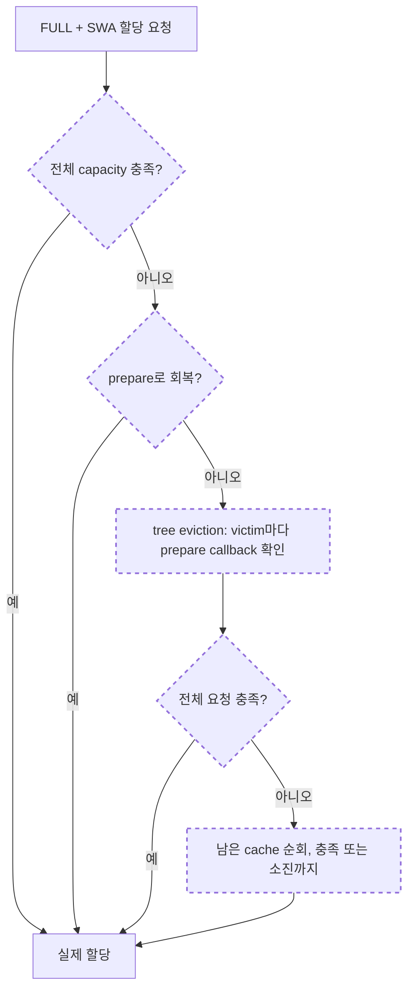

# PR #39294 리뷰 코멘트 분석과 대응 결과

현재 PR을 그대로 승인하기에는 C1/C2의 설계 문제와 C3의 통합 문제가 남아 있습니다. 지정한 Codex 세션의 두 차례 승인을 받아, #36729 기반의 격리된 two-pool 수정 후보를 구현하고 CPU 검증했습니다. 이것은 tri-pool까지 해결된 최종 제출본이라는 뜻은 아닙니다.

검토 대상은 #39294 `276771eefc`, 비교 대상은 #36729 `6c8bbdf610`입니다. 서로 base가 달라 결과를 각 브랜치의 동작 비교로 해석했습니다. 코멘트는 ch-wan의 inline thread 5개이며, 별도의 reviewer 본문 코멘트는 없었습니다.

현재 #39294의 흐름은 다음과 같습니다. 점선은 이 PR이 추가하거나 변경한 단계입니다. 검토의 핵심은 tree의 종료 조건 안에서 preparation까지 수행한다는 점입니다.

## 1. C1: eviction 중 호출하는 predicate가 실제 메모리를 변경한다

[코멘트 원문](https://github.com/sgl-project/sglang/pull/39294#discussion_r4003049663)

리뷰어는 준비 함수 `prepare_token_allocation()`을 `allocation_ready`라는 callback으로 넘기는 구조를 P1으로 지적했습니다. tree가 victim마다 종료 조건을 확인할 때 deferred free 반영이나 compaction까지 실행할 수 있기 때문입니다. 자리가 있는지 묻는 함수가 실제 메모리 배치를 바꾸면, 호출 횟수를 늘리는 작은 수정이 큰 비용으로 이어질 수 있습니다.

이 설계 지적은 타당합니다. 다만 “victim마다 실제 compaction이 발생했다”는 단정은 실험으로 확인되지 않았습니다. 기존 byte guard가 있어서, 87개 leaf를 지우는 CPU 사례에서 prepare는 92번 호출됐지만 helper의 recovery ladder는 0번이었습니다. 반면 전체 helper→alloc을 계측하면 eager eviction 자체에서 48페이지 이동이 발생했습니다. prepare 호출, urgent compaction, 일반 free에 수반되는 이동을 구분해야 합니다. 과거 Inkling 성능 차이의 원인이 이것이라고 주장할 근거도 없습니다.

대응은 이름 변경이 아니라 순수 판정과 실제 준비 작업의 분리입니다. 승인된 two-pool 후보에서는 tree가 추가 eviction이 필요한지만 순수 planner로 확인하고, 실제 ensure는 순회 뒤 allocator가 수행합니다. deep eviction의 prepare/ensure 호출은 2번이며, victim마다 실제 준비 작업을 하지 않습니다. 기존 데이터와 정확한 survivor 집합도 확인했습니다.

단순히 기존 `token_allocation_ready()`만 callback으로 바꾸는 방법은 채택하면 안 됩니다. lazy tri-pool에서 Mamba의 해제된 공간을 정리하면 prefix 하나만 지우고 충분한데, 즉시 capacity만 보면 prefix를 하나 더 지우는 반례를 재현했습니다.

## 2. C2: 처음부터 불가능한 요청이 prefix cache를 전부 비운다

[코멘트 원문](https://github.com/sgl-project/sglang/pull/39294#discussion_r4003049666)

현재 fallback은 전체 FULL/SWA/Mamba evictable 양을 quota로 넣고, callback이 끝까지 false이면 캐시를 모두 순회합니다. 실제로 101-token 요청이 불가능한 fixture에서 캐시 96개가 모두 사라지고 최종 할당도 실패했습니다.

이는 수정해야 할 동작입니다. 기존 테스트가 “불가능하면 cache가 비워진다”를 기대하고 있다는 점도 바꿔야 합니다. 다만 같은 fixture에서 PR 이전 helper도 캐시를 비웠으므로, 이 현상이 모두 이번 PR에서 새로 발생했다고 설명하면 부정확합니다.

두 번째 fallback 직전에만 제한을 넣어서는 충분하지 않습니다. 첫 eviction pass에서 이미 prefix를 잃을 수 있습니다. 또한 매번 자원을 해제하고 있다면 no-progress 조건으로는 막을 수 없습니다. 첫 destructive eviction 전에 allocator가 현재 자원으로 충족 가능한지 판단해야 합니다.

추가로 prefill의 보수적인 demand를 조심해야 합니다. 실제 요청보다 큰 probe가 불가능해도 정확한 요청은 가능할 수 있습니다. #36729에서 coarse 400 / exact 396 / cached 2 pages 사례가 실제 Python caller의 OOM으로 끝나는 것을 재현했습니다. 후보에서는 일반 unsharded two-pool extend의 정확한 새 페이지 수를 eviction 전에 전달해 해결했습니다. 불가능한 exact demand는 캐시를 보존하며 실패합니다.

## 3. C3: #36729와 같은 영역을 다른 구조로 수정하고 있다

[코멘트 원문](https://github.com/sgl-project/sglang/pull/39294#discussion_r4003049670)

리뷰어의 핵심은 두 PR을 그대로 병합하면 allocator dispatch와 capacity 판단이 충돌한다는 것입니다. #36729는 allocator가 reclaim plan과 ensure를 소유합니다. 현재 PR의 common helper/callback 구조와 겹치므로, 어떤 구조를 기준으로 유지할지 정리해야 합니다.

그래서 기존 회귀 시나리오를 실제 동작 기준으로 포팅해 비교했습니다. #36729는 불가능한 요청의 캐시 보존은 잘 처리했지만, 그대로 전체 대체할 수는 없었습니다.

| 대표 사례 | #39294 | #36729 | two-pool 후보 |
|---|---|---|---|
| 6-page 요청 후 prefix | 93개 보존 | 91개 보존 | 93개 보존 |
| 90-page 요청 후 prefix | 9개 보존 | 전부 eviction | 9개 보존 |
| queued free, 초기 prefix 94개 | 94개 보존 | 93개 보존 | 94개 보존 |
| 불가능한 요청, 초기 prefix 96개 | 전부 eviction | 96개 보존 | 96개 보존 |
| exact prefill은 가능한 coarse-probe 사례 | 성공 | OOM | 성공 |
| tri: 96 tokens + 8 states, demand 4 | 성공 | 할당 실패 | tri 동작은 변경하지 않음 |

현재는 #36729의 two-pool planner를 재사용하고, 실제 cascade를 관찰하는 순수 종료 조건·entry drain·exact demand hook을 보완한 후보를 준비했습니다. 누적 eviction quota와 개별 allocator shortfall을 혼용하지 않도록 callback 경로의 계약도 명시했습니다.

tri-pool에는 기존 4회 retry 경로가 남아 있고, 위 실패를 실제로 재현했습니다. 따라서 “#36729가 이 PR을 전부 해결하므로 닫으면 된다”는 결론은 아직 낼 수 없습니다. 두 PR의 최종 배치와 tri-pool의 잔여 수정은 별도로 결정해야 합니다.

## 4. C4: StreamingSession의 None 분기가 불필요하다

[코멘트 원문](https://github.com/sgl-project/sglang/pull/39294#discussion_r4003049675)

현재 in-tree 구현들은 같은 optional keyword를 받습니다. None인 경우만 따로 호출하는 분기는 필요 없습니다. 후보에서는 항상 keyword를 전달하도록 단순화했습니다.

기존 mock의 호출 여부만 확인하는 테스트 대신 실제 StreamingSession→cache→allocator 경로에서 할당과 prefix/KV 보존을 확인했습니다. Python session cursor도 검증했습니다. Rust TreeCore는 session-radix-cache를 명시적으로 지원하지 않으므로, 해당 조합을 통과했다고 표시하지 않았습니다.

## 5. C5: allocation_ready라는 이름이 side effect를 숨긴다

[코멘트 원문](https://github.com/sgl-project/sglang/pull/39294#discussion_r4003049679)

C1과 같은 문제를 API 의미 측면에서 지적한 것입니다. `ready`를 읽고 호출자가 상태 조회라고 이해하는 것은 자연스럽습니다. 실제로 이동과 deferred free가 발생한다면 이름과 계약이 맞지 않습니다.

후보의 `allocation_reclaim_satisfied`는 “더 이상 prefix를 버리지 않고, 허용된 preparation 후 할당할 수 있다”는 순수 판정입니다. 즉시 할당 가능하다는 뜻과 구분했습니다. 실제 mutation은 allocator의 명시적인 ensure에 남겼습니다. pending queue·mapping·holes·live count·byte frontier의 독립 복사본으로 순수성을 검사했습니다.

검토 과정에서 callback의 메모리 주소를 rank-consensus가 비교하면 rank마다 다르게 보일 수 있다는 문제도 확인했습니다. quota와 callback 유무를 비교하고, allocator 경계에서 실제 demand를 비교하도록 최소 수정했습니다. 활성화된 실제 decorator 경로도 통과했습니다.

## 실행과 남은 범위

지정한 세션 `01a09f85-77de-79d1-a50d-cb7a530616c1`의 승인 문서는 PLAN_REVIEW.md와 STAGE_B_REVIEW.md입니다. 그 범위에 따라 격리된 candidate를 구현했습니다.

- 새 Python: 14 tests / 39 subtests 통과.
- 실제 Rust extension: 13 tests / 39 subtests 통과. 미지원 session cursor 조합 1개는 제외.
- 기존 CPU 회귀: 196 tests / 1,392 subtests 통과. GPU test 8개는 실행하지 않음.
- 전체 pre-commit 통과.
- 기존 prefix와 request-owned KV, 반드시 살아남아야 하는 conv/temporal state를 구분해 검사함.

candidate는 `/home/sukwoo24/sglang-eval-worktrees/review-joint-candidate`에 있습니다. 상세 근거와 재현 명령은 CANDIDATE_REVIEW.md, comparison.md, case JSON 및 로그에 있습니다.

남은 핵심은 tri-pool의 순수 recoverability 판정과 실제 production 수정입니다. 제한된 END-compaction 판정 실험은 앞서 본 추가 eviction 반례를 해결했지만, float relocation·다른 page grid·pending reuse까지 완성된 판정은 아닙니다. GPU movement/event/graph 검증도 아직 하지 않았습니다. 따라서 two-pool 후보의 CPU 성공을 전체 PR의 정확성이나 merge 승인으로 확대해서는 안 됩니다.
