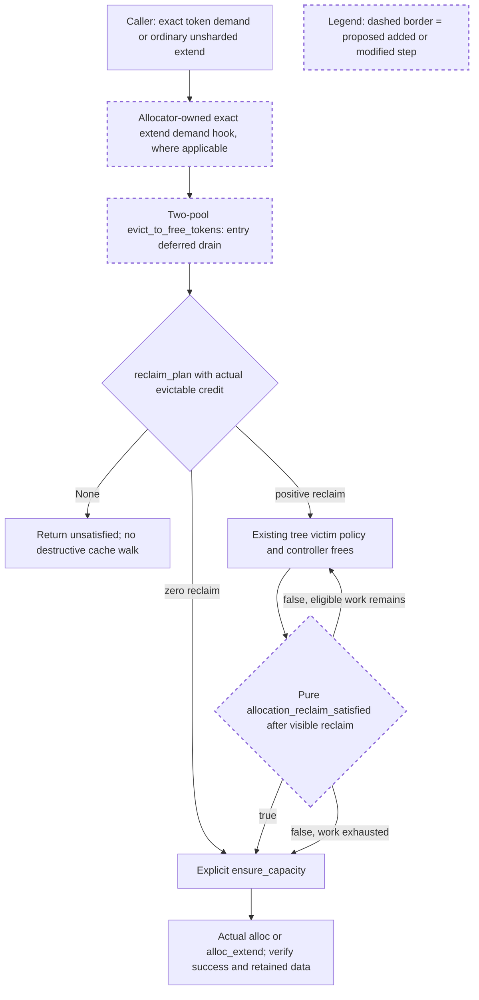

# PR #39294 — Stage B review

**Decision: APPROVED — isolated two-pool candidate 구현 및 해당 CPU 검증, tri-pool 추가 Stage A 실험에 한정.**

- Reviewer session: `01a09f85-77de-79d1-a50d-cb7a530616c1` (사용자가 지정한 원래 세션)
- Review date: 2026-09-14 (Asia/Seoul)
- Reviewed proposal: `comparison.md`
- **Proposal SHA256: `ba2879701ddbec0e60dffe9dec791a47d092825326e4ffb6c237a53366dafefa`**
- Original plan SHA256: `dd62c1e2eda2bc45388b3f0aaec52bd02e004928b7fd75f990250a7d1f452eec`
- Frozen #39294: `276771eefca951ae6d55608415f2d795cbfabdae`
- Frozen #36729 / candidate base: `6c8bbdf610fae5a3ddba826162bc7ca91e79dbfb`

이 문서는 원래 reviewer session의 명시적 후속 승인이다. 요청 세션은 아래 조건을 적용하여 별도 local candidate에서 two-pool 구현과 CPU 검증을 시작할 수 있다. 사전에 통합 tri-pool 설계를 완성할 필요는 없다. 다만 이 승인은 #39294 전체 대체, tri-pool production fix, merge readiness 또는 GPU/remote 작업 승인이 아니다. 원래 문제의 tri-pool 부분은 계속 미해결로 추적한다.

## 제안의 실행 흐름

- #36729의 allocator-owned dispatch와 two-pool `reclaim_plan`을 재사용한다. 입구에서 pending composite frees를 적용한 후 현재 cache로 충족할 수 있는 demand인지 계획한다.
- `allocation_reclaim_satisfied`는 추가 eviction 없이 허용된 preparation 후 할당 가능한지를 조회하는 순수 predicate다. `reclaim_plan(n, n) == (0, 0)`를 evictable credit 없이 평가하는 안을 승인한다.
- tree가 cascade로 실제 해제한 자원이 allocator에 반영된 뒤 predicate를 확인하고, 조기 종료 후 명시적으로 `ensure_capacity`를 호출한다. 일반 unsharded two-pool extend는 CPU length 정보로 정확한 새 page 수를 계산하여 eviction demand를 전달한다.



predicate true는 즉시 할당 가능하다는 뜻이 아니라, 더 이상 prefix를 버리지 않고 허용된 preparation으로 demand를 충족할 수 있다는 뜻이다. 따라서 tree는 멈출 수 있지만 caller는 `ensure_capacity`와 실제 할당 결과를 확인해야 한다. `None`은 주어진 현재 자원·gate·evictable credit 아래의 실패이며, 항상 영구 불가능을 뜻하지는 않는다. 위 흐름은 승인한 설계이며 아직 구현·검증된 결과가 아니다.

## 증거 확인과 수용한 결론

`comparison.md` hash, manifest에 기재된 두 harness 및 6개 case JSON hash가 모두 일치했다. 각 arm의 main 45 rows, supplement 11 rows와 PASS/FAIL 집계도 일치했다. 두 frozen worktree는 요청한 SHA에 있고 검토 시 `git status --short`가 비어 있었다. harness 코드를 읽고 JSON과 source를 대조했으며, 검토자가 실험을 재실행한 것은 아니다.

이번 설계 검토에서도 관련 예정 경로와 `eviction / locked / compaction`으로 Humanize corpus 전체 40,110 threads를 sweep해 2 threads / 2 PRs를 확인했다. 앞선 PLAN_REVIEW의 별도 conversation sweep 137 threads / 137 PRs 및 이미 읽은 suffix lifecycle 논의를 함께 적용했다. 반복된 기준은 locked/live data 보호, cascade 이후 실제 survivor와 후속 동작 검증이다. 단순 PASS 수나 eviction tracker만으로 정확성을 판단하지 않는다.

| 관측 | 독립 검토 판단 |
| --- | --- |
| #39294 impossible demand에서 96→0 | JSON과 harness의 실제 allocation 실패 및 survivor 수가 일치한다. 현재 보존 요구를 충족하지 못한다. 다른 base 대비 새 회귀라는 주장은 하지 않는다. |
| #36729 paired demand 6에서 91, demand 90에서 0 survival | 동일 byte/page geometry와 실제 allocation 결과가 확인된다. 이 fixture의 기대값 93/9에 비해 과잉 eviction이다. planner를 실제 cascade 결과로 조기 종료시키는 변경 근거로 충분하다. |
| #36729 queued ordinary/representative frees에서 94→93 | 입구의 deferred reclaim 처리가 필요한 근거다. 현재 FULL-only case는 이미 ready여서 동일 결함의 재현으로 세지 않는다. |
| #36729 tri 96 tokens/8 states demand 4 실패 | eager/lazy 모두 실제 allocation 실패이며 #39294의 성공과 구별된다. unchanged #36729를 전체 대체로 승인할 수 없다. |
| pure immediate predicate + boundary prepare의 lazy tri 95→94 | 실제 live conv state를 포함한 반례다. 즉시 capacity만 확인하는 predicate로 모든 pool을 통일하는 안은 배제한다. |
| coarse 400 probe, exact 396, cached 2 pages의 #36729 extend OOM | 실제 Python caller의 실패이며 CPU reference가 대체한 부분은 외부 Triton kernel 경계다. exact demand를 eviction 전에 전달하는 변경 근거로 인정한다. GPU kernel correctness 증거는 아니다. |
| helper부터 실제 allocation까지의 movement counter | callback/ensure 횟수와 실제 이동을 구분한 것은 타당하다. eager eviction 자체의 이동을 urgent compaction으로 해석하지 않는다. |

## 증거의 보완 사항

1. **Temporal payload 보존 주장은 현재 자료로 성립하지 않는다.** `stage_a_edges.py:55–76`은 남은 key/state만 검사한다. temporal `[1,4,8]`, state_count 3 case는 세 arm의 eager/lazy 모두 `survivors=[]`, `states_preserved=[]`다. 즉 nonempty temporal tensor를 만들고 allocation이 성공한 것은 확인하지만, 살아남은 temporal payload 비교는 0회다. 기존 증거 파일은 보존하고 후속 보고서에서 이 항목을 보존 검증 미완료로 정정한다. tri 추가 실험에서는 eviction 대상 밖에 반드시 남아야 하는 temporal state와 KV를 두고 예상 live ID 집합을 사전에 고정해 검사한다. 잘못 해제된 state를 mapping이 음수라는 이유로 검사 대상에서 제외하면 안 된다.
2. **순수성 검증은 제안 predicate를 대상으로 다시 해야 한다.** `stage_a_edges.py:165–175`는 기존 immediate `ready`를 호출한다. 또한 queue snapshot이 deep copy가 아니라 참조 tuple이므로 in-place queue 변경 검출에는 불충분하다. 후보의 `reclaim_plan(..., evictable_credit=0)` 경로에서 nonempty pending queues, gate, holes 조건을 사용하고 contents/mappings/live IDs/byte layout을 독립 복사해 검사한다. memo 갱신과 실제 자원 변경은 구분한다.
3. **몇 가지 Stage A 조건은 아직 완료되지 않았다.** node-less progress, active session cursor, 실제 ScheduleBatch decode, async pending reuse는 명시된 NOT_RUN 그대로 인정한다. two-pool 구현에 직접 걸리는 CPU lifecycle 사례는 아래 후보 검증에서 채운다. 미완료를 숨기거나 전부 통과한 Stage A로 기록하지 않는다. 여기서 승인하는 것은 근거가 충분한 좁은 구현 착수다.

이 보완 사항은 two-pool 구현 착수를 막지 않는다. temporal 결과는 tri 설계 승인 근거로 사용하지 않고, 순수성과 lifecycle은 후보 수용 전에 검증한다.

## 승인한 구현 범위와 계약

1. **입구 drain:** `UnifiedSWATokenToKVPoolAllocator.evict_to_free_tokens`에서 ordinary/representative/FULL-only pending groups를 기존 allocator-owned helper로 처리하고 caller의 free-group scope를 보존한다. cache walk 안에서 callback이 queue를 drain하지 않는다. pending이 없고 이미 ready인 경로에는 실제 drain/eviction/movement가 없어야 한다. 필요한 즉시 free의 eager 이동은 별도로 계수한다.
2. **순수 reclaim predicate:** BasePrefixCache, UnifiedRadixCache, StreamingSession에 optional plumbing을 추가할 수 있다. allocator가 callable을 제공하고 tree는 pool geometry를 해석하지 않는다. `None` 경로와 명시적 count-based `evict` 계약은 유지한다. two-pool callback이 true면 후속 component도 불필요하게 순회하지 않아야 한다. false일 때 기존 개별 component capacity 비교가 전체 joint demand 충족 증명으로 둔갑해서는 안 된다.
3. **단위와 walk bound:** #36729 `unified_hybrid_swa.py:831`은 planner 출력을 cumulative eviction targets로 설명하지만 `unified_radix_cache.py:603–615`는 입력을 shortfall로 받아 현재 availability에 더한다. 새로운 callback을 연결하면서 이 의미 차이를 명시하고 테스트한다. planner target은 victim 선택/유한한 reclaim 계획의 근거이며, 전체 demand의 성공 여부는 순수 predicate와 final ensure가 판단한다. callback false 또는 plan exhaustion을 이유로 #39294의 전체-cache fallback을 무조건 복원하는 것은 승인하지 않는다. planner quota를 달성해도 할당이 실패하는 사례가 나오면 재현과 계약 분석을 별도 checkpoint에 제출한다.
4. **실제 reclaim 이후 확인:** callback은 controller action이 적용된 뒤 평가한다. 이 SHA의 일반 FULL component free는 `full_attn_allocator.free_segment`로 직접 들어가고 SWA는 `free_swa_segment`를 사용한다. composite queue와 동일한 경로라고 가정하지 않는다. entry drain 후에도 pending group 때문에 tree reclaim이 보이지 않는 경로가 있다면 분리된 CPU fixture로 드러내야 한다. 그 문제를 predicate 내부 mutation으로 해결하지 않는다.
5. **명시적 preparation:** post-walk `ensure_capacity`와 allocation 내부의 재확인은 허용한다. 안정된 상태에서 post-walk ensure가 성공했다면 뒤의 alloc ensure는 추가 expensive flush가 없어야 한다. callback에는 urgent flush/movement가 없어야 하며, callback 횟수는 victim 수에 비례할 수 있다. 여기서 승인하는 bound는 전체 eager free 이동을 상수로 제한한다는 뜻이 아니다. ensure 실패/closed gate/pending reuse에서는 성공 시의 비용 bound를 그대로 주장하지 말고 실제 결과와 실패 경로를 검사한다.
6. **exact extend demand hook:** base의 typed method와 일반 unsharded two-pool override를 통한 caller 연결을 승인한다. CPU `prefix_lens_cpu`/`seq_lens_cpu`와 기존 `get_num_new_pages`의 동일 rounding을 사용해 token 단위 demand를 반환한다. 두 pool이 동일한 새 virtual pages를 바인딩하는 일반 `alloc_extend` 범위다. base default는 기존 conservative/sharded demand를 보존한다. DCP/DSV4, tail-only extend, tri-pool 또는 다른 allocator의 의미 변경은 승인하지 않는다. #36729의 two-pool과 tri-pool은 `UnifiedSWAAllocatorBase`를 공유하므로 override 위치를 two-pool concrete class로 제한하고 dispatch를 검증한다. 새 `hasattr`/`getattr` fallback이나 scheduler의 별도 byte 모델은 도입하지 않는다.
7. **rank-consensus 호환성:** #36729 `unified_radix_cache.py:599`의 `@rank_consensus(same_params=True, same_results=True)`는 그대로 두고 새 callable을 전달할 수 없다. `rank_consensus_checker.py`는 whole-scope argument의 `repr`를 비교하므로 closure 주소가 rank마다 다를 수 있다. 해당 call site에서 안정적인 semantic input과 result를 선택적으로 비교하도록 최소 수정하는 것을 승인한다. callback 유무와 필요한 demand 의미를 유지하고 raw callable 주소를 비교하지 않는다. 전체 checker 비활성화나 unrelated checker 재설계는 승인하지 않는다. enabled-mode CPU 검증을 추가한다.

허용된 production-code 수정은 위 delta에 필요한 allocator base/two-pool, allocation caller, prefix-cache/controller/session plumbing 및 해당 decorator의 최소 변경이다. 테스트·문서·formatting 수정은 그 범위를 설명하거나 검증하는 데 한정한다. tree engine 알고리즘, tri feasibility, CUDA/Triton movement kernel, GPU event ordering 변경은 별도 승인 대상이다. 구현 중 이 경계를 넘는 해결책이 필요하면 기존 허용 작업은 보존하고 구체적 delta를 다시 제출한다.

## 후보의 CPU 수용 기준

- 같은 two-pool geometry에서 demand 3/4/6/90이 실제 할당에 성공하고 96/95/93/9 prefixes를 남긴다. eager/lazy, page 1/4/16을 포함하고 단순 count뿐 아니라 deterministic 예상 key/virtual-ID 집합 및 distinct K/V를 확인한다.
- impossible byte demand와 독립적인 ID-limit demand를 분리한다. 지금의 101/200 case는 byte 한계에도 걸리므로 독립 ID guard 검증을 대신하지 못한다. oversized exact demand와 all-locked 사례가 cache를 보존하며 실패해야 한다.
- queued ordinary/representative free는 94 prefixes를 보존하고 성공한다. FULL-only도 entry drain이 없으면 정말 shortfall인 fixture로 추가하며, group 재개/종료 후 leak·double-free가 없어야 한다.
- exact extend의 400 probe/396 exact/2 cached pages 사례를 통과한다. 추가로 existing partial last page, batch별 서로 다른 prefix 길이, zero-new-page extend, page boundary, 일부 prefix가 반드시 살아남는 reclaim 사례를 포함한다. 정확한 output index·page 수와 기존 prefix 보존을 검사한다. 기본 allocator/DCP/DSV4로의 hook dispatch는 기존 demand가 유지됨을 CPU로 확인한다.
- 실제 internal tombstone `node_id=None, made_progress=True`에서 drain 후 첫 충족 지점에 멈추고 다음 victim을 보존하는 사례, active session cursor와 locked peer 보호를 실제 cache/controller로 검증한다. callback-free 기존 `evict_for_alloc`, Mamba donor/ID recovery, count-based `evict` 동작도 회귀가 없어야 한다.
- Python 및 Rust TreeCore의 관련 CPU lane을 실행하고 실제 Rust extension이 로드됐는지 기록한다. 실행 불가면 NOT_RUN 원인을 제출하며 Python PASS로 대체하지 않는다. 두 pool 수정으로 기존 tri 결과가 악화되지 않는지도 baseline과 비교한다. 기존 tri FAIL은 해결했다고 표시하지 않는다.
- 실제 ScheduleBatch decode 호출의 `requests/spec_algorithm` keyword 경로를 CPU fixture로 확인한다. decode 인터페이스 확장이나 retraction 정책 변경은 이번 목적이 아니다.
- candidate predicate 순수성, helper→alloc 전체 비용, gates/holes 아래 ensure postcondition과 rank-consensus enabled mode를 확인한다. live GPU event 안전성은 CPU로 인증하지 않는다.
- 변경에 맞는 기존 planner/allocator/byte-accounting/capacity/session tests와 repository-required formatting/pre-commit을 isolated candidate에서 수행한다. 새 테스트 작성 전 해당 checkout의 test/README 및 적용 skill 지침을 따른다. 실패를 없애기 위해 기대 survivor나 불변식을 완화하지 않는다.

CPU 결과와 source diff가 이 기준을 충족하면 다음 검토에 제출한다. GPU, serving timing, graph validation 및 최종 수용 승인은 그때 별도로 결정한다. NOT_RUN이 있으면 후보 검토 요청은 가능하지만 미검증 항목을 통과로 간주하지 않는다.

## Tri-pool 추가 Stage A 범위

CPU harness와 명시적 experimental ablation에서 page-grid-aware pure recoverability oracle 또는 allocator-owned explicit checkpoint를 탐색하는 것을 승인한다. two-pool candidate 구현과 별도로 보존하고 production tri 경로에 합치지 않는다. concrete two-pool planner를 float geometry에 적용하는 것은 금지한다.

최소 제출물은 96-token/8-state lazy case에서 95-prefix 보존 및 실제 allocation 성공, unequal page grids/empty·live float/closed gate/unchanged state의 예측 대 실현 비교, nonempty surviving conv와 temporal payload, pending-reclaim 구분, recovery 시도·실제 moved bytes의 bound다. oracle은 allocator/production recovery 구현을 호출해 상태를 바꾼 결과를 순수 예측으로 보고해서는 안 된다. 잘못된 positive와 negative를 모두 기록하고, 실제 GPU event 검증 필요성은 열린 항목으로 둔다. 구체적인 tri delta는 원래 세션의 별도 승인 후에만 production 후보에 적용한다.

## 실행 권한과 다음 제출

| 작업 | 승인 상태 |
| --- | --- |
| #36729 frozen SHA에서 새 isolated two-pool candidate 구현 | APPROVED — 위 계약과 파일/행동 범위 내 |
| 해당 후보의 targeted CPU tests, Rust CPU lane, formatting/pre-commit | APPROVED |
| tri oracle/checkpoint의 추가 CPU Stage A harness 실험 | APPROVED — production tri 수정 제외 |
| 기존 frozen arms 및 증거를 보존한 후속 보고서 작성 | APPROVED |
| tri production fix, two-pool 후보를 #39294 전체 대체로 채택 | NOT YET APPROVED |
| GPU/serving/graph 실행, kernel/event ordering 수정 | NOT AUTHORIZED BY THIS REVIEW |
| 기존 사용자/제출 branch 재작성, push, GitHub comment/review, PR close | NOT AUTHORIZED |

후속 제출에는 candidate base/head와 전체 diff hash, harness/test diff, 명령·환경·PASS/FAIL/NOT_RUN, C1–C5 상태, 위 보완 항목의 처리 결과를 포함한다. 기존 comparison 및 case JSON은 덮어쓰지 말고 새 artifact로 변경 이력을 유지한다. 이번 승인으로 허용된 구현/CPU 작업을 시작하기 위한 추가 확인은 필요 없다.

검토자는 이 `STAGE_B_REVIEW.md`만 작성했다. source 구현, 비교 재실행, GPU 실행, remote 변경은 수행하지 않았다. 이 승인은 기존 PLAN_REVIEW의 Stage C/D 제한을 여기 명시한 two-pool 구현·CPU 검증 범위에서만 해제한다.

## Supplement 검토 및 cumulative reclaim API 확정 — 2026-09-14

**Decision remains APPROVED.** two-pool 구현/CPU 검증과 tri CPU 실험의 기존 승인은 유지한다. 아래 API 구체화는 승인 범위에 포함되며 이를 구현하기 위해 다시 승인받을 필요는 없다. tri production/GPU/remote 작업 권한은 확대하지 않는다. 이 추가 절은 위의 optional callback plumbing 표현보다 구체적인 API 선호와 조건을 정한다.

검토 자료:

- `stage-a-supplement.md` SHA256: `09739ebfe48ac625b9446aa3f1b124f7bfedca86c1604c93a804ef0d53ba7d01`
- `temporal_live_probe.py` SHA256: `fa80a47db8bb5eae8dfca152424f32251125863e35bb9abfbcd0be437d86731a`
- `tri_oracle_probe.py` SHA256: `e87abc70bb158ce838dd85eda0106158d6148c7a89e535618b52b0f37801b640`
- `pr39294-tri-end-oracle-cases.json` SHA256: `71e47edef602ab265855ad072662cf512b7605353609b995eac1c79cc2371dcd`
- `tri-end-oracle-trace.json` SHA256: `98c94f87af3792c2a09c823cc185e4603aaddd36b571fd8d225bb971fb77c310`

원본 comparison hash는 여전히 `ba2879701ddbec0e60dffe9dec791a47d092825326e4ffb6c237a53366dafefa`다. 추가 harness와 결과 JSON을 읽고 대조했으며 재실행하지 않았다.

### 추가 증거에 대한 판단

새 temporal fixture의 세 arm × eager/lazy 6개 결과에서 `allocated=true`, `states_preserved=[3,4]`이며, 해당 두 state의 conv 및 nonempty temporal payload 비교가 실제 실행된다. 따라서 이전의 **temporal survival 검사가 공허했다는 증거 공백은 이 별도 CPU 관측으로 보완되었다.** 이 case의 KV prefixes는 여전히 모두 evict되므로 temporal과 retained KV를 동시에 보호한 결과로 확대하지 않는다. 정식 regression test에는 예상 state ID 집합 `[3,4]`가 반드시 남는다는 assertion도 추가한다. 현재 helper는 mapping이 사라진 state를 건너뛰므로 잘못된 추가 free가 미래에 발생할 때 단순 PASS만으로 잡지 못할 수 있다.

제한된 END-flush oracle의 6개 row도 PASS다. 특히 lazy 96-token/8-state case는 trace에서 cached=95, immediate=false, sufficient=true로 전환되고, 후속 실제 allocation과 남은 payload 확인이 성공한다. **이 특정 반례에서는 immediate capacity보다 recoverability를 조회해야 prefix를 덜 버릴 수 있다는 설계 근거**로 인정한다. 전체 tri oracle의 soundness/completeness를 인증하는 결과는 아니다. oracle arm의 temporal case는 여전히 state_count=3이므로 새 5-state 보존 결과가 oracle arm에도 검증됐다고 간주하지 않는다.

`credit()`이 직접 더하는 값에 `_pending_reuse`가 없다는 것만으로 pending-reuse 안전성이 증명되지는 않는다. frontier, reusable-hole 배치, 실제 flush의 event/gate 조건을 함께 대조해야 한다. zero/partial demand, page-grid alignment, live/transparent float, closed gate에서의 거짓 positive 여부도 아직 미검증이다. oracle false는 UNKNOWN이며 cache 전체 소진이나 영구 불가능의 근거로 사용하지 않는다는 제한에 동의한다. 이 CPU 실험을 그대로 production tri 코드로 옮기는 것은 승인하지 않는다.

### 선호 API: 별도 `evict_for_reclaim` 진입점

**같은 `EvictParams`를 callback 유무에 따라 shortfall 또는 cumulative target으로 재해석하기보다, 별도 named entry point를 선호하고 승인한다.** 다음 형태면 충분하며 새 generic eviction framework나 별도 planner 계층은 필요 없다.

```python
def evict_for_reclaim(
    self,
    reclaim_targets: EvictParams,
    *,
    allocation_reclaim_satisfied: Callable[[], bool],
) -> EvictResult:
    ...
```

- `evict_for_alloc(params)`는 기존 shortfall 계약을 유지한다. `evict(params)`도 기존 count 계약을 유지한다.
- 새 `evict_for_reclaim`은 **이번 호출 시작부터 누적된 component eviction target**을 받는다. FULL/SWA는 logical token 수이며 bytes/pages나 absolute pending allocation demand가 아니다. planner의 `n`은 allocator callback에 보관하고 tree가 계산하지 않는다.
- 새 경로에서는 `available_size_targets`를 만들거나 기존 shortfall 목표를 합산하지 않는다. 기존 `_evict`/`_evict_components`를 재사용할 수 있지만 cumulative quota mode와 availability-target mode를 내부에서도 명시적으로 구별하고 동시에 활성화하지 않는다.
- BasePrefixCache에 명시적 interface, UnifiedRadixCache에 동작 구현, StreamingSession에 직접 forwarding을 둔다. 미지원 cache에 대해 callback을 무시하고 일반 `evict_for_alloc`으로 조용히 fallback하지 않는다. base default는 fail-fast `NotImplementedError`로 둘 수 있다. 기존 none/disabled/chunk-cache bypass와 실제 factory routing을 검증하여 미지원 implementation이 새 경로에 진입하지 않음을 확인한다. `hasattr` 또는 예외를 잡는 호환 fallback은 추가하지 않는다.
- #36729 two-pool allocator만 새 진입점을 사용한다. Mamba donor와 기존 tri 경로를 이 API로 일괄 이관하지 않는다. 이름의 사소한 조정은 가능하나 shortfall과 cumulative target이 호출부에서 명확히 구별돼야 한다.

이 변경으로 callable이 기존 decorated `evict_for_alloc` 경계를 통과하지 않더라도, **새 진입점 역시 rank-consensus 정책을 유지해야 한다.** 새 경로의 안정적인 reclaim target, callback 존재/의미를 표현하는 안정적 값, 결과를 비교하며 closure 객체의 `repr`는 제외한다. bool 결과를 얻으려고 checker가 callback을 추가 호출하는 방식은 피한다. 앞 절의 enabled-mode CPU 검증 조건은 유지한다.

### Cumulative mode의 정확한 종료·계수 조건

1. 호출 입구에서 predicate가 true이면 zero result로 반환한다. 아직 false이면 기존 component/victim 순서를 따른다. 단순 FULL/SWA availability 상승은 이 모드의 조기 종료 조건이 아니다.
2. tracker는 호출 전체에서 누적하고 peer cascade를 정확히 한 번 반영한다. 예를 들어 cumulative SWA target=5인데 앞선 FULL walk가 SWA 3을 해제했다면 SWA는 2만 더 필요하다. TreeCore가 global tracker와 비교하는 target에는 원래 5를 전달한다. target을 2로 줄이면서 tracker=3을 그대로 넘겨 이중 차감하지 않는다. 다른 adapter 계약이면 그 변환을 명시하고 Python/Rust 모두 검증한다.
3. controller가 내부 tombstone frees를 적용한 직후 predicate를 확인한다. 같은 step이 반환한 다음 leaf가 아직 파괴되지 않았다면 그 leaf를 추가 eviction하기 전에 joint 조건을 확인할 수 있어야 한다. 이후 leaf eviction/cascade의 frees가 적용된 뒤에도 확인한다. 조기 종료 시 `evict_device_end` 등 cursor cleanup은 보장한다. 이를 위해 TreeCore 내부 알고리즘을 수정해야 한다면 그 delta는 별도 검토한다.
4. predicate true이면 **전체 planned walk**를 끝낸다. false인 상태에서 한 component의 cumulative target이 충족됐으면 그 component만 종료/skip하고 다음 계획 component로 진행한다. `node_id=None, made_progress=True`를 exhaustion으로 오인하지 않는다.
5. 모든 계획 target을 충족했거나 해당 eligible victims가 소진되면 유한하게 반환한다. 이 반환은 allocation 성공 표시가 아니다. predicate가 아직 false라고 target을 전체 cache 크기로 자동 확대하거나 같은 quota를 초기화하여 재시도하지 않는다. 불만족 결과는 allocator의 explicit ensure 및 caller 실패 처리로 이어지고, 필요 시 새 근거와 함께 replanning 설계를 별도 검토한다.
6. quota는 기존 tree의 atomic leaf/cascade 단위로 충족한다. 마지막 leaf가 여러 token을 담거나 peer를 cascade하면 count가 quota를 넘을 수 있다. 이를 엄격한 byte별 상한 또는 전역 최소 eviction 보장으로 문서화하지 않는다. atomic overshoot 이후 추가 victim을 선택하지 않는 것과 가능한 첫 joint 충족 지점에 멈추는 것이 요구사항이다.
7. zero quotas + predicate false는 zero eviction 후 unsatisfied로 끝나야 한다. predicate true + positive quotas는 zero eviction이다. callback은 mapping/queue/layout을 바꾸지 않으며 group drain과 final ensure는 allocator의 명시적인 경계에 둔다.

이 API를 적용하는 최소 regression에는 다음을 포함한다: FULL cascade가 SWA quota 일부/전부를 충족하는 경우, node-less progress 직후 다음 prefix 보존, predicate true의 전체 walk 중단, quota exhaustion인데 predicate false인 경우의 유한 종료, zero-quota 양쪽 predicate 값, indivisible leaf overshoot, callback-free 기존 shortfall/count 경로 유지. 기존에 승인한 6/90-page survivor 및 exact extend 테스트를 함께 통과해야 한다.

이 추가 절은 자료 수용 및 API 구체화이며 새로운 production 실행을 수행한 기록은 아니다. 검토자가 수정한 파일은 계속 `STAGE_B_REVIEW.md`뿐이다.
