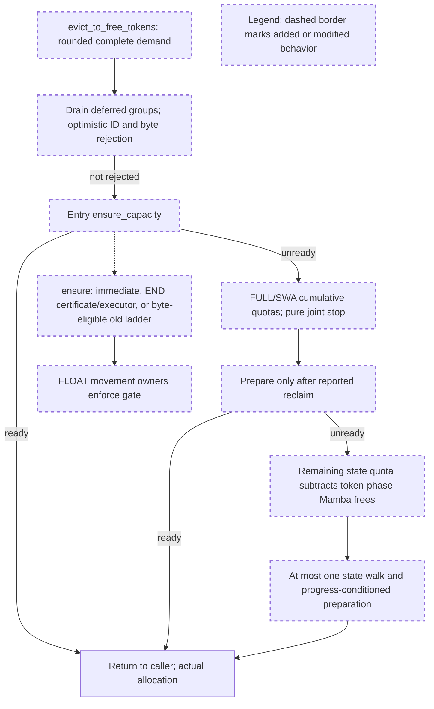

# Tri candidate CPU acceptance and bounded GPU plan review

Reviewed on 2026-09-14. This review concerns the isolated composed candidate, not the original PR's current merge readiness.

## Change comprehension

- `UnifiedMambaSWATokenToKVPoolAllocator.evict_to_free_tokens` replaces the old four-round retry with entry preparation, a cumulative FULL/SWA reclaim phase, and at most one separately budgeted Mamba phase.
- `_token_reclaim_satisfied` is a sufficient, metadata-only END recovery query. `ensure_capacity` executes that END path and checks its postcondition; a negative certificate can use existing FLOAT recovery when current bytes permit it.
- The concrete tri extend hook forwards exact ordinary, unsharded page demand. Physical allocation retains actual namespace/page/byte bounds without imposing nominal conservation caps.
- FLOAT `make_room` and `compact_holes` now enforce their movement gate before settling events or moving data. The accepted two-pool implementation is unchanged.

The helper rejects provably impossible demand before walking cache entries. Otherwise it prepares at entry and after allocator-visible reclaim in each of two finite phases. Every preparation uses the same allocator-owned ensure policy shown at the side of the diagram. A certificate-positive path flushes ENDs without first changing FLOAT layout; a certificate-negative result is unknown. The caller still performs actual allocation, with its own existing ensure boundary.

## Historical review evidence

The exact-path/risk-term sweep scanned all 40,110 corpus threads but returned no matches. A widened memory-cache/session/test-path sweep with `memory`, `cache`, and `cuda` scanned all 40,110 and matched 955 inline threads across 345 PRs. A separate `unified` conversation sweep scanned all 40,110 and matched 306 conversations across 306 PRs; these counts are separate, not additive unique coverage.

The relevant recurring concerns are real payload ownership, stream lifetime, page sizes greater than one, and regressions reproduced on the actual runtime path. Examples include the page-size request in [#21206](https://github.com/sgl-project/sglang/pull/21206#discussion_r3073478308), transfer-index lifetime in [#22940](https://github.com/sgl-project/sglang/pull/22940#discussion_r3102970721), and the request for a concrete corruption reproduction in [#31427](https://github.com/sgl-project/sglang/pull/31427#issuecomment-4988853176). These inform the validation judgment below; they do not establish correctness of this newer allocator implementation.

## Decision: APPROVED for the submitted CPU candidate

**The isolated tri CPU candidate is accepted. No mandatory production-code or CPU-test correction remains for this checkpoint.** This includes the separately reviewable FLOAT movement-gate fix and the tri policy delta. The decision incorporates the capacity amendment and explicitly resolves the previously requested but unisolated corner cases below.

Exact reviewed identities:

| Artifact | SHA256 or Git identity |
| --- | --- |
| `TRI_CANDIDATE_REVIEW.md` | `b3099d79e517913e038c04dc3cd2fe337d1df1950f468427db1bb7cb8bb24966` |
| Frozen base | `6c8bbdf610fae5a3ddba826162bc7ca91e79dbfb` |
| Immutable accepted two-pool patch | `cfc5b3c6c2593189b5a1c15a3f5b774eba55d19a1813d32013de0f68ec6cd2bf` |
| `tri-float-gate-final.patch` | `17f4315c16427607c2de7787b5db265bd8ad05b4a9c5a142b2ec4f596fc0a682` |
| `tri-policy-final.patch` | `17f1fb3de3fbcf6af687b5b6ede17cc2ac4a36bcf9a7ba5d9516a84484e268bd` |
| `tri-composed-final.patch` | `fb1484263d9f170ff26b87764af5bcb9987b9251c8948ea23637cb3580a144ec` |
| Accepted composed tree | `0b1bd85dd84bad2fb6bc0d4b3c79429dc510304b` |

All entries in `tri-candidate-manifest.json` matched their files. Independently generated read-only tree diffs matched both separate patches byte-for-byte, from accepted tree `e4adfed934c78ebd659152d2990de85f6e3e17dc` through guard tree `49db88df391369e7c713546811cbf2806a574f4f` to the composed tree. The current staged diff matched the composed patch hash and tree; there was no unstaged delta. I did not reapply patches or run tests. The accepted two-pool patch remains byte-identical; the composed test expectation change correctly acknowledges tri's separately authorized exact-demand override.

### Findings and acceptance rationale

No blocking correctness finding was identified in the reviewed delta.

- `unified_hybrid_swa.py:1270–1377`: ensure, certificate and byte bound implement distinct contracts. The query does not drain, move, wait or fetch FLOAT hole positions. The current-ID/SWA physical-envelope guard is independent of nominal capacity reporting. The paired constructor gives SWA the FULL owner's virtual namespace. END execution returns actual joint availability without using a FLOAT fallback to conceal a failed positive certificate. The optimistic sink/live-byte calculation is a rejection bound, not a geometric solver.
- `unified_hybrid_swa.py:1562–1639`: the token phase uses cumulative counts through the accepted callback mode. Its actual returned Mamba count is subtracted once before a fresh state-phase tracker. Post-phase ensure calls are guarded by nonzero returned reclaim counts; there is no retry loop. At most three helper ensure calls plus the caller's ensure is the supported per-attempt bound, not a global bound across scheduler retries or a bound on all eager free-induced copies.
- `unified_sub_pool.py:2382–2388,2595–2602`: the closed FLOAT gate returns before event settlement, relocation and hole-position scans. Computing the existing gap or hole count is metadata-only. Open behavior is retained. The two production `make_room` call sites under `mem_cache` route through the guarded owner; no production `compact_holes` invocation was found in that area.

The logged final results support this limited acceptance: CPU **229 passed / 1,489 subtests passed / 8 GPU skips**; actual-Rust lane **31 passed / 97 subtests passed / 2 session exclusions**; all-files pre-commit passed. Guard-only registered tests report **3 passed / 7 subtests passed**. These are inspected submitted results, not independent reviewer reruns. Historical failing logs remain distinct from final results.

The existing 72-geometry physical-capacity test is unchanged. New tests exercise physical allocation above nominal headroom, actual decode, exact ordinary extend, legal state-only reclaim, predetermined request-owned KV and nonempty temporal payloads, grouped frees, session behavior, and rank-consensus instrumentation. Rust session support and actual distributed communication remain outside the demonstrated lane.

I also checked the final geometry wrapper calls the production predicate. Its 864 rows contain 451 certificate positives, all allocating, and 484 actual allocation successes with no reported payload/accounting error. The 33 additional successes demonstrate incompleteness of the sufficient certificate. The pressure matrix supplies 15 initially unready END positives across page sizes 1/4/16; negative-query PASS rows are not allocation proofs. Pending-event results exercise CPU control flow. The retention comparisons cover the stated 95/93/9 targets and the 12 equal-count/different-hole FLOAT layouts, whose first feasible recovery is at entry.

### Explicit disposition of remaining corners

**Greater-than-quota cascade:** accepted as an unexecuted independent runtime corner. Do not restore invalid multi-state-per-node fixtures to satisfy a coverage count. Legal partial and exact single-state cases exercise the actual returned-count contract on both backends. The remaining subtraction is directly saturated with `max(0, ...)`, and zero suppresses the second walk. This is adequate for this checkpoint; it is not a claim that a greater-than-quota cascade is impossible in every tree topology or that its runtime behavior was tested. This decision waives the earlier demand for an additional isolated greater-than-quota fixture before CPU acceptance.

**No progress after a real attempted walk:** accepted as an explicitly unisolated corner. The test named `test_ready_and_no_progress_skip_repeated_preparation` establishes ready-path behavior and finite gated recovery, not that exact exhausted-walk scenario. Source inspection shows both post-walk preparations require actual nonzero reclaim and there is no return edge to retry a phase. Together with the surrounding real-walk tests, that is sufficient here. This decision waives a further isolated fixture at this checkpoint; do not relabel existing coverage as having executed it.

**FLOAT completeness and retention:** no universal or mid-walk first-feasible FLOAT solver is accepted or required here. The reported geometry/retention evidence is limited to its layouts. New supported-path allocation regressions or material excess eviction found during integration require investigation; CPU acceptance does not turn an unknown certificate into an impossibility result.

## GPU plan decision: APPROVED for one bounded local harness lane

Reviewed `TRI_GPU_PLAN.md` SHA256: `8a7ed5ce2b72b9eecf5934fb263616b5f6a84eb01b8b4f1f74c8f613c4861afb`.

**The CPU acceptance prerequisite is satisfied. Implement and run the proposed local RTX 5090 allocator/event/graph marker harness now, subject to the following execution conditions; no additional preliminary approval is needed for that harness.** These clarify what constitutes a valid PASS, rather than requiring another production delta.

1. Pin imports to the accepted composed tree and record the complete command, harness hash and actual GPU/software versions. Recheck free memory before launch. Retain the plan's at-least-4-GiB free threshold, below-1-GiB fixture budget, one GPU process at a time and 180-second process timeout. Record actual peak memory, including runtime overhead separately from fixture storage. Leave unrelated processes untouched. A timeout or CUDA error ends that lane for diagnosis; do not silently retry or alter kernels.
2. Use production CUDA factories and real binding, translation and copy kernels. Establish successful fixture setup and predetermined retained virtual IDs before eviction. Check distinct FULL K/V, SWA K/V, conv and nonempty temporal markers, plus actual allocation and retention. Include eager/lazy controls and page size greater than one. Respect existing factory restrictions: a paged tri allocator fixture must not falsely imply supported paged Mamba-checkpoint caching.
3. Separate **writer ordering** from **pending reader reuse**. For the former, arrange an outstanding forward event and writes to original physical locations of live data that recovery must actually move; pass the correct original virtual write set where the existing hook expects it. For the latter, use a legal read-only survivor scenario so nonurgent compaction can move data and genuinely create pending source pages. Confirm a nonzero pending set while the real event is unfinished, then urgent dependency/drain and safe allocation. If execution completes too early to exercise this transition, mark that case inconclusive/NOT_RUN, not PASS.
4. Do not host-synchronize or add a harness stream wait immediately before recovery in a way that settles the dependency under test. Setup synchronization and final observation synchronization are appropriate. Record event state and actual move counts; verify relocated data contains the forward's updated values, and pending-source reuse respects the existing event dependency. Preserve production synchronization ownership.
5. Capture the translation/gather read workload once, with stable virtual-ID inputs, mapping-table addresses and output storage. Prove at least one retained allocation's physical placement changed before replay, then replay the **same graph without recapture** and check its values. Capture device translation, not a precomputed host mapping. A replay where no retained page moved is a control, not relocation evidence. Do not capture host-driven eviction or claim full-model graph support.
6. Exercise movement gates in supported lazy END configurations and the FLOAT owner independently; eager END movement explicitly rejects an installed PD gate in the existing source. Check zero forbidden copy calls while no-movement allocation remains usable, then reopen and demonstrate real movement with payload preservation. This validates the gate contract, not live PD/RDMA traffic.
7. Publish commands, source/harness identities, per-case PASS/FAIL/NOT_RUN, allocation/retention results, actual movement/event observations and graph replay evidence. Keep correctness observations distinct from performance. Submit the results for review before expanding into observer-free timing or serving.

No serving process, model download, remote GPU use, unrelated process shutdown, production source modification, push, public comment or merge is included in this bounded lane. Local drafting of reviewer replies and integration options is appropriate, as proposed. The user's broader merge objective remains active, but C3 still requires author/maintainer integration agreement and refreshed heads; this review supplies neither that agreement nor a maintainer merge approval.

The reviewer created only this acceptance artifact. No production edits, test/experiment execution, GPU workload or remote action was performed.
