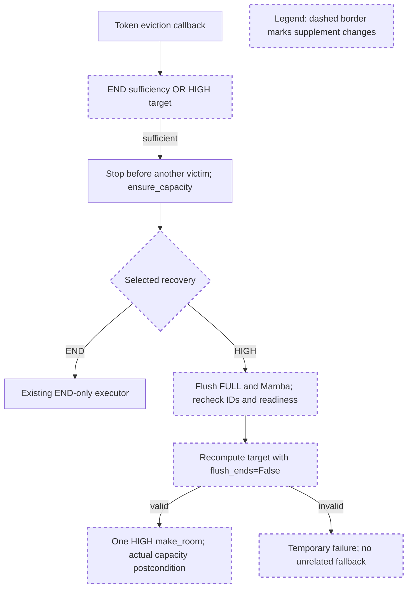

# Renewed tri FLOAT candidate acceptance

Reviewed request SHA256: `d2497cf78eecb55a72d4bd6d2ff07ef17a4cbc02a1dc8553479d49f4d822051f` (`TRI_FLOAT_CANDIDATE_REVIEW_REQUEST.md`).

## Comprehension

- The two-file supplement adds an allocator-owned sufficient HIGH-side FLOAT target and tests. The pure callback now recognizes either END-only recovery or this HIGH target.
- `ensure_capacity` distinguishes these paths. For HIGH recovery it flushes FULL then Mamba, recomputes with `flush_ends=False`, makes one matching move, and checks actual joint capacity and index headroom.
- Tests pin the temporal first-victim regression, partial/whole movement, fresh-gap boundaries and changed gates. The previous phases, quotas, two-pool implementation and FLOAT movement-owner guards are unchanged.



The new stop condition prevents eviction of the large leaf when moving FLOAT can satisfy the request after the first victim. Execution uses current prepared frontiers, so a gate change cannot leave a stale projected target in use. The existing general ladder remains available only for certificate-negative layouts.

The exhaustive historical sweep scanned 40,110 threads, matching 932 memory-cache threads across 339 PRs; the separate unified-cache conversation sweep matched 306 conversations across 306 PRs. Recurring concerns include keeping mutation with its owner, covering alternate callers and reproducing lifecycle failures. The ownership discussion in #23678 and regression discussion in #31902 support this narrow allocator change and real first-victim tests. The concrete findings below are based on the submitted source and harness.

## Production CPU candidate: APPROVED

**Renewed CPU acceptance is granted for tree `fe601ec6fc21ca0efc9c914385f9e3ffc77ccacf`. No mandatory production-source or CPU-test correction remains at this checkpoint.** The specific temporal retention regression is resolved in the demonstrated CPU path. The previous failed tree remains preserved; it is not retroactively accepted.

| Identity | Value |
| --- | --- |
| Frozen #36729 base | `6c8bbdf610fae5a3ddba826162bc7ca91e79dbfb` |
| Preserved failed tri tree | `0b1bd85dd84bad2fb6bc0d4b3c79429dc510304b` |
| Supplement patch SHA256 | `6d886b7e2f63a7c88c36b811369ae697123121cb2e3ae9b9ced949ff7275bc23` |
| Full composed patch SHA256 | `1ed1e2a56a4a637697e46fb0ed54484735e0ab6b6b60eb747e67eeca0f4b7e9b` |
| Accepted composed tree | `fe601ec6fc21ca0efc9c914385f9e3ffc77ccacf` |

All files in `tri-float-final-manifest.json` matched their hashes at inspection. The generated staged binary diff matched the full composed patch byte-for-byte. The tree-to-tree diff from the preserved failed candidate matched the two-file supplement byte-for-byte. The index matched the submitted tree and had no unstaged change.

### Source and validation judgment

No blocking correctness issue was identified in the production delta. In `unified_hybrid_swa.py:1270–1396`, the extracted END projection preserves the prior formula, HIGH sufficiency implements the approved inward page-grid reservation, and the executor uses actual post-flush geometry rather than crediting an additional unexecuted flush. IDs and capacity are rechecked; no positive-plan failure falls through to general recovery. No callback movement, device hole-position read, extra phase, quota expansion or nominal-cap reintroduction was added.

The added registered tests establish:

- Temporal state-first eager/lazy allocation of four after exactly **1 FULL / 1 SWA / 1 state** reclaimed, with **95 tokens retained**, one **256-byte absolute target**, unchanged callback snapshots, retained KV/conv/temporal payload and no general ladder.
- Both partial and whole `make_room` branches, including fresh LOW reservation equality and one-page-short rejection at page sizes 1/4/16. The one-short case tests an unknown certificate, not universal impossibility.
- Changed FULL gate recomputes **224 bytes** and uses unflushed FULL holes; changed Mamba/FLOAT gates return temporary failure without movement/fallback. Reopening allows allocation. Existing END-only tests still forbid FLOAT movement.

Inspected final logs report **276 Python CPU tests passed / 1,597 subtests passed / 10 GPU skips**, **36 actual-Rust tests passed / 138 subtests passed / 2 session-cursor exclusions**, and all-files pre-commit PASS. `run_tri_float_cpu.sh` records the 13-file selection and environment; the increase from 229 tests is not solely five added methods. Existing joint, gate and physical-capacity tests remain selected. These are submitted execution results, not reviewer reruns.

The production geometry wrapper calls the new methods directly: 864 rows, 477 positives including 26 HIGH-only positives, no reported errors or positive allocation failures, with general fallback forbidden for positive cases. The production pending probe has 18 PASS rows and genuine CPU pending metadata. These support the limited certificate and CPU event control flow; they do not establish universal FLOAT completeness, real GPU ordering, distributed behavior or model accuracy.

## GPU harness v2: CHANGES_REQUESTED at the submitted hash

Reviewed `gpu_tri_validation_v2.py`, SHA256 `85ee1f30895784f7422cd01c175a3b4ad87535c3e82bc48bec167e46bf9e96ce`. **Do not execute this exact revision.** Two misplaced/missing state-translation statements cause three undefined-name errors:

1. **`collect`, line 41:** `mids` is read without being defined. The nonempty conv view makes the first `gold = collect(...)` fail, even in a non-event control. Define `mids = a.mamba_allocator.translate_kv_loc_for_kernel(states)` inside `collect` before gathering state views. This translation belongs in the captured reader so replay observes changed mappings.
2. **`update_forward`, line 49:** `a` and `states` are not in scope. More importantly, this statement overwrites the supplied fixed state destinations and reintroduces the writer translation that the previous review required removing. Delete that statement; use the function's supplied `mids` unchanged for the delayed state writes. Do not fix the NameError by adding allocator/virtual-state arguments or globals to the writer.

I verified these without importing or executing the harness using:

```text
/home/sukwoo24/.venv_sglang_upstream_full/bin/ruff check --select F821 gpu_tri_validation_v2.py
```

It reported undefined `mids`, `a` and `states`. A syntax-only check cannot detect these errors. The repository pre-commit PASS does not validate this out-of-tree harness.

The rest of the reviewed ownership correction is appropriate: a real lock receipt protects the retained cache node, only its final KV and request-owned final state receive writes, original destination tensors are cloned during setup, marker offsets are selective, and the lock is released after synchronization. Keep those properties and the actual state-mapping-change/same-graph replay assertions.

## Bounded GPU resumption: authorized after the two harness fixes

**This review authorizes correcting the two statements above and then resuming the bounded local GPU lane after the non-GPU undefined-name check passes. No additional preliminary permission request is required for those exact harness corrections and execution.** Record the revised harness hash and corrected file with its results. The submitted `85ee1f...` revision itself remains rejected. Any further production change requires its own concrete review; GPU validation must import the CPU-accepted tree above.

Carry forward the original lane limits: one local RTX 5090 process, at least 4 GiB free before launch, below-1-GiB fixture allocation budget, external 180-second process timeout, exact environment/source/command provenance, and unrelated processes untouched. Preserve failures and stop on CUDA errors, timeouts or material retention regressions. No serving, model download, remote mutation or kernel workaround is included.

The initial eight-case subset is authorized. Its event cases must use the corrected fixed-address writer and captured translating reader. An unfinished event at a relevant dependency boundary plus actual retained-state movement is required for conclusive ordering evidence; final synchronization alone is insufficient. Eager free can settle through its existing `wait_stream` before `_settle_inflight_forward` is reached, so the current settle-only observer may legitimately label eager overlap INCONCLUSIVE. Keep that label rather than weakening it to PASS; a separately recorded eager dependency observation may be added within the harness scope if needed.

Pending-reader reuse, independent movement gates, two-pool CUDA and page sizes greater than one remain required parts of the already bounded GPU plan, not claims supplied by eight subset results. Adding those harness cases within the existing scope is authorized. Submit GPU results for review before expanding to performance or serving. C3 author/maintainer agreement, refreshed integration heads and eventual merge remain outstanding; CPU acceptance and conditional GPU resumption do not imply merge readiness.

The reviewer created only this acceptance artifact and ran read-only source/hash inspection plus the non-GPU static name check. No production/harness code was edited, no CPU experiment was rerun, and no GPU or remote action occurred.
