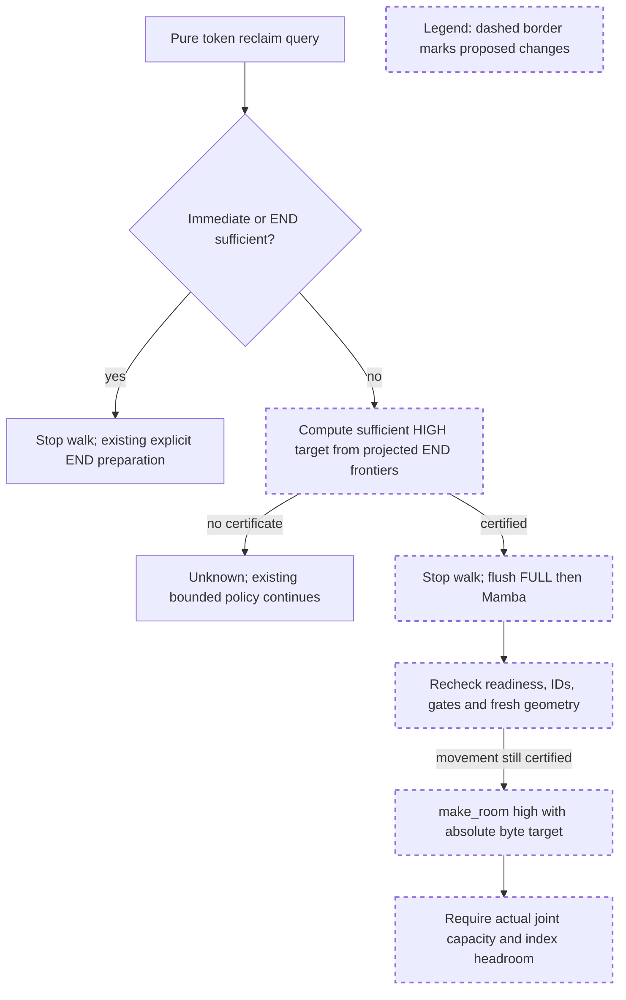

# Supplemental HIGH-side FLOAT plan review

Reviewed plan: `TRI_FLOAT_SUPPLEMENT_PLAN.md`, SHA256 **`67a274cfbc18394d6a1bd7a45f6a3a85807127630ab54f4faf73d7174dfe39b9`**.

Base is the frozen composed tree `0b1bd85dd84bad2fb6bc0d4b3c79429dc510304b`, patch `fb1484263d9f170ff26b87764af5bcb9987b9251c8948ea23637cb3580a144ec`, on commit `6c8bbdf610fae5a3ddba826162bc7ca91e79dbfb`. The inspected candidate index still matches this tree and has no unstaged delta.

## Comprehension

- The current END-only callback misses a FLOAT-recoverable layout after one victim and walks into the 94-token leaf. The supplement adds a pure sufficient HIGH-side recovery target to the existing stop query.
- The new certificate reserves fresh LOW destinations for FLOAT retreat and fresh HIGH pages for SWA after FULL allocation. It needs no FLOAT hole-position read.
- Explicit ensure keeps END and FLOAT execution separate, revalidates after END preparation, calls the existing guarded `make_room` once, and checks actual allocation capacity. Reclaim phases and quotas stay unchanged.



The query stops eviction before destructive overshoot when a specific permitted FLOAT move can satisfy demand. Movement remains outside the callback. A selected certificate cannot fall through to an unrelated ladder to conceal a failed executor postcondition; the existing fallback is reserved for certificate-negative layouts.

## Historical review synthesis

An exhaustive sweep of all 40,110 corpus threads, covering the proposed allocator/test paths and widened memory-cache paths with `memory`/`cache`, matched 932 threads across 339 PRs. The separate unified-cache conversation sweep covers 306 conversations across 306 PRs. The recurring concerns are mutation at the owning abstraction, compatibility through actual callers, and concrete regression tests. For example, #23678 asks that tree mutation remain with the tree owner, and #31902 pairs a narrowly scoped lifecycle fix with reproduced regression tests. This supports keeping the new geometry in the allocator and leaving TreeCore unchanged; the sufficiency argument below is checked against the actual frozen implementation, not inferred from historical precedent.

## Decision: APPROVED for implementation and CPU validation

**Implement the proposed supplement in a new isolated layer/worktree and run CPU validation. No further preliminary permission is needed within the scope and conditions below.** The concept and conservative reservation are sufficiently concrete for this checkpoint. This does not restore final acceptance of the regressed tri candidate and does not authorize GPU resumption.

### Sufficiency argument checked against make_room

I inspected `FloatMultiEndedAllocator.make_room` in `unified_sub_pool.py:2372–2484`, including the current-gap check, whole-pool capacity check, source selection, far-gap destination check and reconstruction of the final span.

Use the plan's inward-rounded `lo`, `hi`, `hi1`, current FLOAT interval `[L,H)`, requested paired pages `N`, `limit = hi1 - N`, and positive retreat `R = H - limit`. Let `V` be the live FLOAT page count. In a valid layout `V <= H-L`. The condition `L-lo >= R` implies:

```text
lo + V <= L - R + V <= H - R = limit
hi - lo - V >= hi - limit
```

Thus the existing whole-pool capacity check accepts the absolute target `T = (hi-limit)*eS`. The current HIGH gap is `(hi-H)*eS`, so `make_room` computes exactly `R` additional pages for this target.

- **Partial branch, `0 < R < V`:** it selects the R highest live pages. At most R fresh destinations are needed, and the reserved LOW gap supplies all R even if no usable hole helps. Every destination is strictly below the selected sources. The highest remaining source or destination is below `H-R`, so the reconstructed upper watermark is at most `limit`.
- **Whole branch, `R >= V`:** packing at `lo` gives upper watermark `lo+V <= limit`. The same reservation puts the destination block below the original live span. This is a certified invocation of the existing whole-pool branch, not authorization for unconditional whole-FLOAT packing or a new relocation algorithm.

After FULL extends, the FLOAT ceiling is `hi1`, leaving at least `hi1-limit = N` fresh HIGH pages for SWA. LOW relocation storage and subsequent HIGH allocation storage are distinct. This proof does not spend FLOAT holes twice or assume their positions.

One wording correction applies to the plan: in the current partial implementation, a fixed R selects R live sources; favorable holes can reduce **fresh destinations** or improve frontier retreat, but do not necessarily reduce the number of moved pages. Do not claim minimal movement or fewer copies merely because holes are present. The new HIGH geometric calculation is O(1); that does not reclassify existing capacity-cache misses or the movement executor itself as O(1).

The first-victim trace provides a concrete check. Both eager state and lazy projected state yield `F0=4768`, `F1=4640`, `M1=1408`, `eS=32`, `L=51`, `H=147`, `N=4`. Therefore `lo=44`, `hi=149`, `hi1=145`, `limit=141`, `R=6`; seven fresh LOW pages cover the six-page retreat, and the exact absolute HIGH target is **256 bytes**, not a 256-byte increment.

### Authorized source scope and contracts

1. Modify the concrete tri allocator in `unified_hybrid_swa.py`: share the minimal END projection between the explicit END certificate and new HIGH-target query; retain `_token_reclaim_satisfied` as their pure disjunction; route ensure through the correct executor. Add focused registered tests in the tri reclaim test area and related isolated diagnostic artifacts. A small optional integer target with a documented `None = unknown` contract is sufficient; no new cross-allocator capability framework is needed.
2. Preserve normalized token/page units, actual FULL-owner IDs, SWA physical envelope bounds, sink/floor limits and the optimistic byte rejection. Do not reintroduce nominal conservation caps or change admission/reporting. Preserve the accepted two-pool and gate patches byte-for-byte as base artifacts.
3. The callback may use host metadata and tensor lengths; no hole-position copy, drain, wait, sort, relocation or stored executable closure plan. Keep END-positive distinct from FLOAT-positive: renaming the old END predicate explicitly is appropriate. Do not port the monkeypatch's dynamic method replacement into production.
4. Execute FULL then Mamba preparation without preceding FLOAT boundary absorption. Check readiness and index headroom afterward. Recompute the absolute HIGH target from the actual post-preparation geometry and current gates. Do not accidentally credit another unexecuted END flush when recomputing; if changed gates or unrealized projection invalidate the selected plan, return temporary failure rather than use stale coordinates or add a recovery loop. The existing FLOAT owner must retain its own final gate check and event ordering.
5. Make at most one matching HIGH `make_room` call in a selected FLOAT preparation and require actual joint capacity plus index headroom afterward. A failed positive plan must not be rescued by the general ladder. Keep that ladder only for certificate-negative, byte-eligible states. No extra phase, per-victim preparation, larger quota, TreeCore/Rust API change, LOW-side solver or shared copy/event implementation change is approved.

### Evidence reviewed and CPU acceptance requirements

The submitted hashes match:

| Artifact | SHA256 |
| --- | --- |
| `tri_float_certificate_probe.py` | `e6ff690d6c6a8032e5d4225e7bee60ea20015dba4ab97e118a306590daad78c5` |
| `tri_high_retention_trace_v2.py` | `7108a044b5deb1009ee063fd253f63b8f30155b999ecb3c77b83b64e7a2b0a74` |
| `tri-high-trace-v2-temporal-float-repro.json` | `d7f5cbb1dec046455610150270b2c390c577e4d01325c8426769504753267921` |
| `tri-high-strict-geometry-cases.json` | `b84ebb4817b5809edaaeb02ed4f78cc620a4caa1845bd1b77ed84822d145ceaa` |
| `tri-high-float-retention-cases.json` | `ea785853bbb7b705c872ff56727e63039ffc824a6cdd44e5a557e539550c82d7` |

The temporal trace reports exactly one FULL, one SWA and one state reclaimed, 95 cached tokens, unchanged query snapshots and no general ladder in both modes. Unlike the earlier reproduction, it checks all 95 retained KV tokens and every retained state, including nonempty temporal payload. The strict 864-row geometry has 477 positives, including 26 HIGH-only positives; no positive ensure/allocation failure or reported accounting/payload error occurred, with the unrelated ladder forbidden for positives. The 12 hole-position comparisons all allocate, retain all four prefixes and report zero ladders. I inspected these scripts/results without rerunning experiments. Results whose fixture construction changes under the ablation are not a controlled coverage delta against the old matrix.

Before renewed candidate acceptance, require:

- A registered legal factory regression for the exact temporal state-first counterexample, eager and lazy, asserting **95 retained**, first phase **1/1/1**, protected KV/conv/temporal markers, pure callback and the exact freshly executed absolute target. Exercise supported Python and actual Rust single-state nodes.
- Direct positive coverage of both `R < V` and `R >= V` execution branches, plus the reservation boundary `L-lo = R` and rejection when it is one page short. Include page sizes 1/4/16 and asymmetric/misaligned grids. For the one-page-short case, assert the certificate is unknown; do not assert universal allocation impossibility.
- Positive-certificate tests with the unrelated ladder forbidden across helper plus actual allocation; unchanged END-only behavior; transparent FLOAT controls; actual preparation/movement counts preserving the existing bound. Keep the original 72 physical-capacity subcases, 95/93/9 retention and all two-pool/gate regressions unchanged.
- Independently closed/reopened END and FLOAT gates, a gate change between query and execution, and genuine CPU pending metadata excluded from current certificate credit. Verify post-flush target recomputation, no stale plan or extra attempt, and zero forbidden movement. Existing mocked-event coverage remains CPU control-flow evidence only.
- Re-run the previously selected Python/Rust CPU suites, the new cases and required all-files checks on the final new layer. Submit new diff/tree hashes, exact commands/import provenance and results; preserve the old failed candidate and comparisons. Do not substitute monkeypatched ablation success for production-candidate validation.

## Next checkpoint

The regression remains open until the implemented supplement and fresh CPU results pass renewed candidate review. GPU execution stays stopped; writer ownership/original-destination corrections remain separately required before any later GPU authorization. No remote action, serving, model download, C3 integration agreement or merge approval is supplied here.

The reviewer created only `TRI_FLOAT_SUPPLEMENT_REVIEW.md`; no source, frozen artifact or existing review was modified, and no experiment/GPU workload was run.
