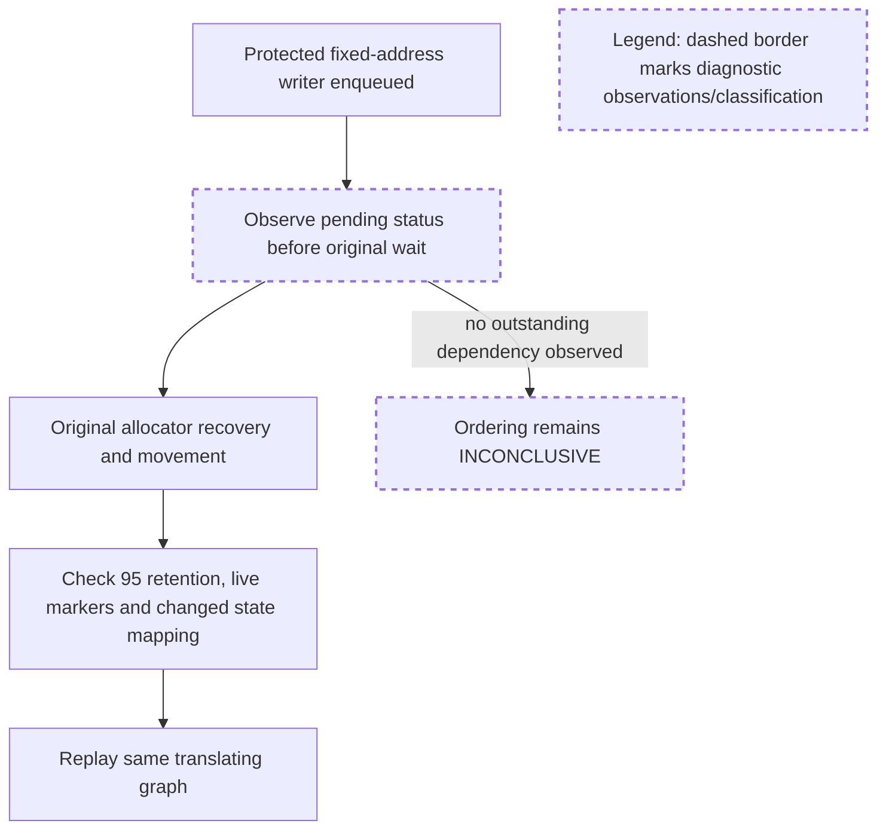

# Bounded GPU evidence disposition

## What was exercised

- CUDA allocator controls check two-pool and tri allocation, prefix retention, retained KV/state payload and page-size behavior on the CPU-accepted candidate.
- The corrected writer harness uses protected virtual IDs, fixed original writer destinations and a translating captured reader. v4 additionally observes the original stream/event waits.
- The corrected gate/pending harness includes allocation in the closed-gate copy observation, allocates and stamps a state under the Mamba gate, and contains exact-source pending/reuse/new-marker checks.

The new observations do not replace or bypass the original waits. Successful allocation, movement and graph checks remain useful even when the intended concurrent dependency was not exercised; they must be reported separately from ordering coverage.

The corpus review scanned all 40,110 threads, matching 932 memory-cache threads across 339 PRs and, in a separate sweep, 306 unified-cache conversations across 306 PRs. Ownership and reproduced data-lifetime failures are recurring concerns. This disposition therefore accepts demonstrated behavior while retaining the unobserved lifetime cases explicitly.

## Decision: APPROVED WITH EXPLICIT VALIDATION LIMITS

**Accept the demonstrated bounded GPU controls for tree `fe601ec6fc21ca0efc9c914385f9e3ffc77ccacf`. No additional GPU environment, longer delay or production synchronization change is required for this local evidence checkpoint.** CPU acceptance remains in effect. This is not full asynchronous-safety certification or a merge-ready determination.

The evidence supports the following, without adding results across repeated versions as independent coverage:

| Surface | Disposition |
| --- | --- |
| Six v3 non-event tri allocation controls | Accepted PASS for their allocation/retention/payload assertions |
| Eight two-pool controls, eager/lazy, page sizes 1/4 | Accepted PASS, including exact 95/9 retained prefix-page records |
| Two paged tri controls with request-owned state | Accepted PASS for actual allocation and retained KV/conv/temporal data |
| Three corrected independent gate controls | Accepted PASS: allocation-inclusive zero closed-owner copies, actual reopened copies, retained data and new Mamba marker |
| Eager v4 writer/recovery/graph case | Accepted observed dependency plus allocation, 95-prefix retention, moved-state payload and same-graph replay |
| Lazy v4 writer/recovery/graph case | Allocation, 95-prefix retention, actual movement and replay assertions accepted; outstanding-writer ordering remains INCONCLUSIVE |
| Corrected pending-reader cases, page sizes 1/4 | INCONCLUSIVE: pending reuse was not created while the event remained unfinished; urgent outstanding-reader drain/reuse is not demonstrated |

The completed corrected gate/pending JSON now contains three gate PASS rows and two pending INCONCLUSIVE rows. The pending branch with exact source membership, allocation reuse and competing marker write was not reached in these runs. Its improved code must not be presented as executed coverage. Earlier uncorrected gate/pending runs are historical diagnostics; the corrected gate rows supply the accepted gate evidence.

In eager v4 the wrapper observes the actual target forward stream still pending immediately before the original `wait_stream` at approximately 1.71 ms. The run moves one Mamba page and six SWA pages, retains 95 tokens, preserves updated protected data and replays the same graph after state relocation. This demonstrates the original dependency being exercised in this fixture; it does not isolate that wait as the only synchronization that could preserve correctness.

Lazy v4 also moves one Mamba and six SWA pages and passes the same retained-data/replay assertions, but all relevant observed dependencies are already complete. Keep that ordering result INCONCLUSIVE.

## Environmental diagnosis and stopping rule

The submitted standalone diagnosis reports three warmed CUDA tensor-construction calls taking approximately 685–688 ms while a prior two-billion-cycle forward event changes from unfinished to finished. Warmed GPU indexing returns in approximately 0.014–0.167 ms while that event remains unfinished. Environment provenance reports RTX 5090, PyTorch 2.13.0+cu130, CUDA 13.0, Triton 3.7.1 and driver 610.62.

I checked the accepted source: `_commit_move_batch` constructs CUDA source/destination tensors from host lists before querying `latest_event`. The probe is therefore consistent with serialization that prevents this prequeued-reader fixture from creating pending metadata in this environment. This is an environment-specific inference from the submitted diagnostic, not a universal guarantee of `torch.tensor` behavior or proof that every lazy path is safe. The reviewer did not rerun the standalone probe.

There is no evidence here selecting a particular alternative environment that would resolve the observation gap. Requiring arbitrary hardware/software changes or repeatedly lengthening delays is not justified for this checkpoint. **Stop further overlap-forcing iterations and finalize the evidence report.** Do not rewrite tensor creation, remove waits, replace real events or inject synthetic pending state into production to obtain a PASS. Existing CPU mocked-event results retain their narrower control-flow meaning.

This disposition explicitly waives a conclusive lazy-writer/pending-reader GPU result as a prerequisite for closing this bounded local validation checkpoint. It does not erase those gaps or establish them for another runtime. A subsequent synchronization/H2D-path change, an actual asynchronous failure, or a maintainer's specifically identified deployment requirement would justify a concrete additional lane with its own scope.

## Provenance inspected

The candidate index still matches the accepted tree and has no unstaged change. v4 and corrected gate/pending provenance hashes match the scripts inspected. Original and corrected artifacts remain separate.

| Artifact | SHA256 |
| --- | --- |
| `tri-gpu-v3-cases.json` | `7e4922891a4d3c1c8c7a4554d34df89c7ab29007b3b88b0e51fe0a25be9fbc48` |
| `tri-gpu-v4-cases.json` | `61218c0e37e09027855844c91c0d57be174a4ced3f22b01b84921c7266b1d681` |
| `gpu-extra-cases.json` | `90f56ca3fee6fc9b76be73cd5f8f3b3f60ef47334b760b0b556c544baf0b056c` |
| `gpu-gate-pending-v3-cases.json` | `5184246b77e7e55c9527040da523518fa836d47ee9af177f5d1e8aa0eacde58c` |
| `gpu-overlap-diagnosis.json` | `2af58a10da9c0ccd659e681a338f2b8089cc82ab52bee438c6abe610a346c759` |
| `gpu_tri_validation_v4.py` | `f6f84cabaf853081842bd81977fe0decb601e6ae3b733caa317a15486e5dad9c` |
| `gpu_gate_pending_validation_v3.py` | `90ba60f739d818740679db03832153f437193dc7a1ca568d83a372bf045d2d09` |

Reported peak PyTorch allocation is 658,944 bytes for the original extra controls and 281,088 bytes for corrected gate/pending; reserved memory is 2,097,152 bytes in each report. These counters do not include all driver/context memory.

## Next work

Prepare the consolidated CPU/GPU evidence and exact local reviewer-reply/integration drafts, preserving the limitations above. A small timing or serving lane still requires the previously requested concrete workload/model/resource plan; these marker runs are not throughput or model-accuracy evidence. C3 author/maintainer coordination, refreshed source heads and merge approval remain outstanding. This disposition authorizes no public message, push, merge or production change.

The reviewer created only this disposition artifact. No source/harness was modified, no GPU workload was run, and no remote action was performed by the reviewer.
