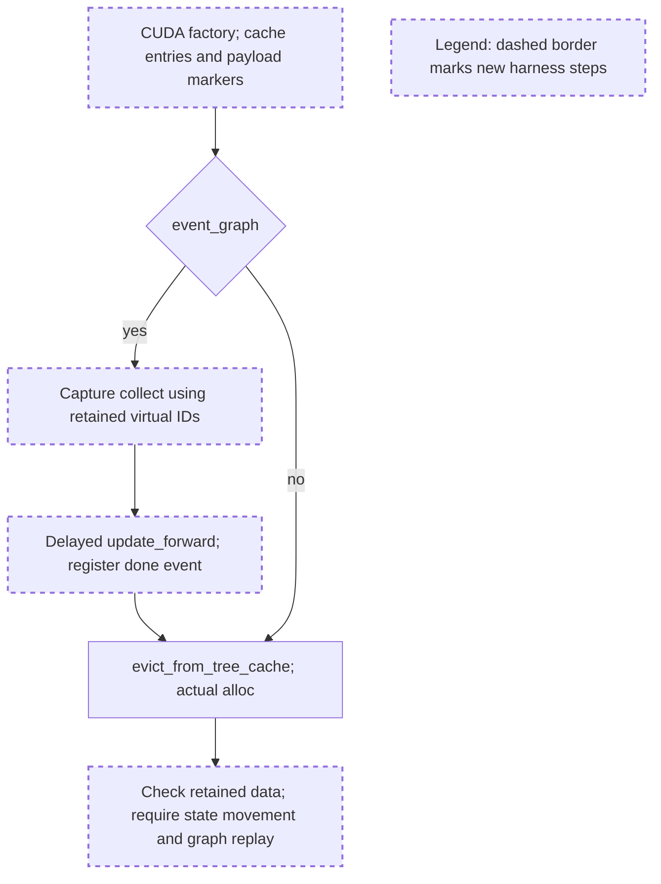

# Concrete GPU harness review

Reviewed `gpu_tri_validation.py`, SHA256 `915b27fffc2ab166f2b2c321017a45faee9e38628e5ccf4d1bf91b4b1761d0c1`, against accepted composed tree `0b1bd85dd84bad2fb6bc0d4b3c79429dc510304b`.

## Comprehension

- Eight cases construct the real CUDA tri factory: six allocation controls and two eager/lazy event-plus-graph cases.
- Event cases capture virtual-ID translation/gathers, enqueue a delayed forward update, register its event, then reclaim cache and allocate.
- They require the protected last state's mapping to change and replay the same graph to read updated payloads. This is useful nonvacuity checking, but the current writer workload needs correction.

The event case runs a forward stream concurrently with scheduler-side reclaim. Its correctness depends on the forward touching only live protected allocations at their original physical locations. Graph replay should then resolve their new locations through unchanged virtual IDs.

The exhaustive corpus sweep scanned 40,110 threads, matching 932 memory-cache threads across 339 PRs; a separate conversation sweep matched 306 unified-cache conversations across 306 PRs. The recurring concerns are actual buffer ownership, stream dependencies and reproductions of the claimed failure. The ownership discussion in #29421 and regression discussion in #31902 reinforce using a legal lifetime fixture; the concrete findings below come from this harness and the accepted source.

## Decision: CHANGES_REQUESTED for this harness revision

**CPU acceptance remains APPROVED. The bounded GPU lane remains authorized. Correct the two writer issues below before running the event/graph cases as validation.** These are harness changes, not production defects. The six non-event controls may run independently within the existing resource limits. Adding the already approved pending-reuse, movement-gate and two-pool cases is also authorized; no new scope approval is needed for those cases.

### 1. Do not write allocations that the concurrent cache walk may free

At lines 97 and 101, the forward receives all `slots` and all `states`, including the cache-owned entries inserted at lines 76–78. The helper can evict those entries before the delayed write executes. In the accepted `MultiEndedAllocator.free` implementation, lazy free deliberately does not wait for the forward: a freed virtual ID must have no ongoing consumer. Its mappings are tombstoned immediately on the scheduler stream. A latest-forward event protects movement/reuse of live survivors; it does not make concurrent use of an explicitly freed cache allocation legal.

Restrict the asynchronous writer to a predetermined protected set. Prefer request-owned state such as the final state, and genuinely request-owned KV or retained KV protected by a real FULL/SWA lock receipt. Exclude every cache-owned checkpoint eligible for this eviction. Keep the evictable checkpoint separate so freeing it can still force the protected final state to move. Pass only the actual protected KV writer set to `set_inflight_forward`, and release any lock receipts correctly after the case. Update marker expectations so only the writer set receives `+17`; untouched live data must retain its original values.

### 2. Freeze writer physical destinations before enqueueing recovery

`update_forward` at lines 41–52 translates virtual IDs on the forward stream after the sleep. Those GPU mapping reads can observe scheduler changes made during reclaim. This does not implement the promised write to original kernel locations: a wrongly ordered move could be followed by translation to the new location, allowing a marker check to pass without proving the required copy dependency. For victims from finding 1, translation can instead observe tombstones, whose kernel translation clamps to the sink.

During synchronized setup, resolve and clone the separate FULL, SWA and state kernel destination tensors for the protected writer set. Retain these tensors through completion. The delayed writer must use those fixed original destinations without consulting mutable translation tables again. Continue passing original virtual writer IDs to the existing inflight hook. The captured read graph should continue doing device translation at replay time; it must not reuse the fixed writer destinations. Keep the existing protected-state movement assertion and same-graph replay assertion.

These two concrete corrections and their execution are already within the approved harness scope. Publish a revised harness hash and the results; this review does not impose another preliminary permission request for implementing these fixes.

## Conditions for interpreting and launching this subset

- The unfinished-event check is presently sampled before the helper call. Warm the relevant GPU paths during setup, and record whether the event is still unfinished when the relevant recovery/free movement dependency is reached. Do not add a synchronizing observation there. If it has completed before the dependency under test, report that overlap case as inconclusive/NOT_RUN rather than evidence of ordering correctness or a production allocator failure. Retain the actual mapping-change requirement.
- Keep writer ordering and pending-reader reuse as separate legal scenarios. These eight cases do not yet demonstrate genuine pending-reuse creation/drain, independent movement gates, two-pool CUDA behavior or page sizes greater than one. Their absence does not block running this first subset, but an eight-case PASS cannot close the entire GPU plan.
- The non-event state-before cases assert exact 95/9 retention; state-after and event cases currently assert a weaker retained-prefix condition. Identify those as allocation/payload or event controls unless an independent exact expected retained set is added. The last cached KV is not request-owned merely because a test calls it so; use the ownership/lock correction above for the event writer.
- Launch from the accepted worktree with its Python path, verify imported module paths, and record the harness/source hashes and full command. Use the previously approved external 180-second process timeout, one GPU process, memory guard and below-1-GiB fixture budget. The script itself does not install the timeout. Record environment information before the cases so a failed run retains provenance, including Triton/driver versions and peak allocated/reserved memory where available. Leave unrelated workloads untouched.
- Stop on CUDA error or timeout, preserve evidence and diagnose. No production edits, model download, serving or remote action is authorized by this harness review.

Only this review artifact was created. The harness and accepted source were not modified or executed; no GPU workload ran in the reviewer session.

At final verification the shared harness had been edited externally and its hash was `01ea1999aa3cd537023716d96e4bf6e490cd24f5c24088cb786e79290bcc61be`. A limited read showed added movement instrumentation, while the all-ID delayed writer and in-forward translation remained. The formal review above is pinned to submitted hash `915b27ff...`; it is not an acceptance of the concurrently edited revision. The two writer corrections still apply to the inspected newer excerpt.
