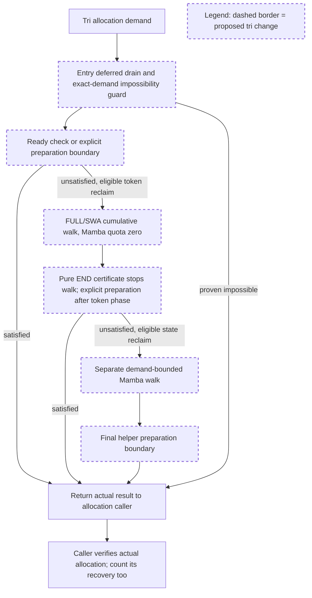

# Tri plan review — revision 1

**Decision: APPROVED — isolated production tri candidate implementation and CPU validation, subject to the concrete conditions below.**

This is the required explicit approval from reviewer session `01a09f85-77de-79d1-a50d-cb7a530616c1`. The implementation session may start the scoped work without another preliminary approval. This is approval to implement and validate the policy, **not acceptance of its final correctness, retention behavior, GPU safety or merge readiness**.

- Date: 2026-09-14 (Asia/Seoul)
- Plan: `TRI_PLAN.md`, revision 1
- **Plan SHA256: `617cca66339400bf8806166e9ac7d767b8c4192eb2bbfabb2ac453390f9b1ad4`**
- Base: frozen #36729 `6c8bbdf610fae5a3ddba826162bc7ca91e79dbfb`
- Immutable accepted two-pool patch: `cfc5b3c6c2593189b5a1c15a3f5b774eba55d19a1813d32013de0f68ec6cd2bf`
- Composition: new `review-tri-candidate` worktree, accepted patch applied unchanged, independently recorded tri delta.

## Understanding the proposed change

- The tri allocator owns a pure END-recovery sufficient certificate, a matching END-only executor, and an optimistic impossibility guard. The cache does not learn FLOAT geometry.
- Unknown layouts may use the existing recovery ladder at explicit allocator boundaries. The cache callback never performs that recovery and never treats an optimistic byte bound as reclaim satisfaction.
- Token reclaim precedes a separate state reclaim phase. Each has a demand-derived finite quota; the policy does not repeat or expand phases to the entire cache.
- Ordinary unsharded tri extend receives an exact-demand override in the concrete tri class, preserving the other allocator/shard defaults.



This is a bounded recovery policy with a sound early-stop certificate for a subset of layouts. It is not a universal tri feasibility planner. The second phase is specifically state reclaim after the token phase, not another iteration of the same joint walk. No available quota or no eligible victim means the relevant phase is skipped and the failure path remains explicit.

## Evidence reviewed

I read `TRI_DESIGN_ADVICE.md`, the plan, v4 and END-only geometry harnesses/results, and bounded v2 harness/results/trace. The submitted files were complete at review. Plan and accepted two-pool patch hashes match the requested values. I did not execute these experiments.

| Artifact | SHA256 |
| --- | --- |
| `tri_geometry_probe_v4.py` | `88b34a18e6ad28565e6c163d01ba11882fa686bab45d3bc9c812f0846a77bc92` |
| `tri_geometry_end_only.py` | `fb8511c52d5f9f1a5486180a12518d351d0244f336686f566dc7484dabeee77c` |
| `tri_bounded_probe_v2.py` | `6636c714e50ab0814b2e8b62fcaaa7b9bbed58c6df9631c22ce2a068b3394262` |
| `tri-geometry-v4-cases.json` | `390b74fdfa93218c2212c9d9920e1b8371f319ab993220e3c877ac4de87c0877` |
| `tri-geometry-end-only-cases.json` | `5bb630cffb259a3b07501c6ba5f509e4a28ee4d81910cdc399d7ee83d7e22e57` |
| `tri-bounded-v2-experimental-cases.json` | `26dffeff5beaf8728362be606a26ddc3fd34eff45db494e77680ff7853781f2f` |
| `tri-bounded-v2-trace.json` | `4910d6747f9589d13e3b9918231b6958f4586170e3695549b7ae989b4d2bd602` |

The narrow historical corpus sweep found no matches, so I widened it to `python/sglang/srt/mem_cache` with `eviction / locked / compaction`: 40,110 threads scanned, 111 matched across 55 PRs. The relevant recurring concerns are locked-peer protection, lifecycle-specific state assertions and avoiding expensive verification in hot paths. The previous conversation sweep and suffix-lifecycle evidence remain applicable. These are review criteria, not a substitute for the geometry results.

### What the new experiments establish

- The v4 matrix has 864 rows, 451 positive certificates, 53 predicate-negative cases whose eventual allocation succeeded, and no reported payload/accounting errors or positive-certificate allocation failures.
- **450 of the 451 positives were already immediately ready. Only one required END recovery.** That nontrivial case is page size 1, FULL:SWA ratio 1:4, lazy, `swa_edges`, gates open, demand 5 pages, immediate capacity 4. The END-only run confirms its executor succeeds without needing the FLOAT ladder. Do not describe the matrix as 451 independent validations of nontrivial END compaction.
- Four v4 rows report `recovered=false` followed by `allocated=true`: page size 1, ratio 1:1, `swa_internal`, demand 7, across eager/lazy and gate values. The final allocation supplies an additional recovery opportunity. Thus the 53 unrecognized successes are eventual helper-plus-alloc observations, not all single-ladder successes.
- Bounded v2 has eight PASS rows: the six factory cases and two strict live KV/temporal cases. The fixed 96-token/8-state case retains 95 in both modes. Temporal factory and strict cases retain their cache in this experiment; 80-token/24-state cases consume their large final leaf and retain zero.
- **These eight rows do not exercise the separate state-only phase.** Entry recovery or the token phase completes first. Its quota, cascades, termination and final preparation remain candidate validation obligations.

These observations are sufficient to proceed with a local implementation. They do not yet establish the full bound or the policy's acceptability on FLOAT-dependent cache layouts.

## Binding implementation conditions

### 1. Implement the written certificate/executor contract, not the experimental `or`

`tri_bounded_probe_v2.py` currently defines recovery as `prepare_end(a, n) or (... and a.ensure_capacity(n, n))`. If the certificate was true but END execution failed, that expression could hide the failure by running unrestricted recovery. PLAN.md's prose explicitly forbids this, and that prose is the approved behavior.

Use distinct control flow: immediate success; otherwise certified END execution with its own verified postcondition; otherwise the guarded unknown-layout ladder. A false END execution postcondition under unchanged preconditions must be exposed as a certificate failure in tests. Do not rescue it with FLOAT and record success as END validation. Recheck gates/preconditions when execution begins; changed preconditions are stale/temporarily blocked, not a soundness failure under the old assumptions.

The v4 certificate does not yet implement all planned details: it treats immediate `available_size()` as sufficient before checking conservation, and subtracts all FULL demand from projected frontier even when a closed gate leaves reusable FULL holes in place. Implement the planned immediate-plus-conservation and usable-hole distinctions explicitly, and add nontrivial tests. Do not silently call the unmodified experimental formula fully validated production code.

### 2. Preserve the exact demand and impossibility distinction

Normalize token/page units once and use rounded new-page demand consistently for virtual-ID/physical-page limits and reclaim quotas. Legacy tri conservation caps are different from the two-pool dynamic contract; verify their actual allocator meaning at the composed revision.

The optimistic rejection bound may over-credit potentially reclaimable bytes, including pending reuse, so that it fails to reject some impossible states. It must not under-credit reclaim and reject a feasible exact demand. Subtract component live bytes once, with FULL/SWA token and Mamba state units kept separate. Preserve locked and request-owned live state. A positive current live-byte shortfall suppresses futile movement; zero shortfall is merely permission to attempt recovery.

Add the concrete tri exact-extend override and caller regression within the scope stated in the plan. Keep ordinary unsharded extend separate from tail-only/speculative/sharded demand. Do not expand admission or Mamba state reservation semantics to make an allocation test pass.

### 3. Treat phase quotas as a policy bound, not a feasibility theorem

The n-page FULL/SWA quotas and `ceil(pair_bytes / state_entry_bytes)` state quota are accepted for this candidate. They bound logical reclaim work by the request scale, subject to indivisible leaf/cascade overshoot. Returning n pages on each side is a resource-accounting argument, **not proof that a particular fragmented FLOAT layout becomes allocatable**.

Run one token phase with Mamba quota zero, then at most one state phase against the state still eligible after token cascades. Derive the second phase's state-byte upper budget without double-crediting earlier frees. Keep each phase's cumulative target/tracker contract explicit. Do not restart the combined three-component walk or silently increase a quota after failure.

This policy may conservatively over-evict in certificate-negative FLOAT layouts. Record first feasible recovery points on diagnostic clones/replays and compare actual retained keys/payloads. A new failure of a formerly working supported path, or material excess eviction relative to the stated retention objectives, requires follow-up review before candidate acceptance. Do not weaken the 95-prefix target or claim C3 closed merely because the loops terminate.

### 4. Count and justify each preparation boundary

The accepted maximum is entry, after token reclaim, after state reclaim, plus the final caller allocation's existing recovery. Within the helper there is no preparation in the victim callback and no retry loop based on epoch changes.

Do not run an additional expensive post-phase attempt when the phase performed no allocator-visible reclaim and the relevant state/preconditions are unchanged. A cheap readiness query is fine. Record actual entry/phase/final-alloc preparation separately; current `observe()` counters wrap `ensure_capacity`, not every standalone `prepare_end` invocation, so they do not alone prove the proposed bound.

The bound is scoped to one helper-plus-allocation attempt. Repeated scheduler/caller retries are separate attempts and must not be described as globally bounded to four. Zero-demand and already-ready cases should avoid actual drain/movement where there are no pending frees to apply. Eager movement caused by real frees remains separately counted.

Keep END copy and FLOAT copy counts distinct. The claim of at most one FLOAT relocation per boundary applies to the selected top-level recovery sequence; verify nested allocation paths as well before publishing a moved-page bound.

### 5. Do not infer gate safety from successful allocations

The v4 `gate=True` rows show eventual allocation results, not an assertion of zero forbidden movement. At this frozen source the END `_flush` checks `disagg_move_gate`, whereas `_float_open_short_side`/`make_room` do not visibly apply the same check; settling the forward event is not a PD move gate.

Instrument actual FLOAT and END movement while independently closing each gate. Preserve reuse that needs no movement. The new composite recovery must not call prohibited relocation merely because the existing ladder was reused. A narrowly scoped guard in the concrete tri allocator/its preparation and final `ensure_capacity` path is within this implementation approval if needed. Do not change shared movement kernels or event machinery without submitting a separate concrete delta. If the supported runtime excludes a tested gate combination, record that restriction rather than presenting the fixture as production support evidence.

## Candidate acceptance gates

All CPU tests listed in `TRI_PLAN.md` remain required for the touched path. In addition, the submission must explicitly demonstrate:

1. Multiple **initially unready** END-positive cases across page size/entry-size/frontier/gate combinations, with FLOAT recovery forbidden during certified execution. Include queued/reusable/pending resources and exact postconditions; zero-demand/ready cases are controls, not END-recovery coverage.
2. A real state-only phase: token quotas exhaust without satisfying demand, remaining evictable Mamba state supplies needed bytes, actual allocation succeeds and predetermined live state survives. Also test zero eligible state and insufficient state reclaim, verifying no repeated phase or whole-cache escalation.
3. Invalid/stale certificate handling, no extra expensive preparation after zero-progress phases, and actual phase counters including the final allocation. Retain the four v4 `ensure=false / alloc=true` cases so recovery-attempt accounting is not inferred from the helper alone.
4. Certificate-negative FLOAT-dependent cases with live cache entries, including same counts/different hole positions. Show actual retention and allocation against the frozen behavior and #39294 where relevant. The current standalone geometry matrix has no cache walk and cannot establish phase-policy retention.
5. Gate-closed/reopened and mocked pending-reuse event transitions with movement assertions, as well as deep independent snapshots proving the callback does not mutate mappings, queues, layout or payload. CPU external-event mocks do not establish actual GPU ordering.
6. Actual extend/decode, Python cache/session and supported Rust lanes; the Rust session limitation stays explicit. Re-run the accepted two-pool tests to establish composition does not change their results. Keep the accepted two-pool patch itself byte-identical.

Use legal production-factory fixtures for cache lifecycle assertions and small legal layouts for geometry comparisons. Preserve failed experiments and explain NOT_RUN entries. For any acceptance blocker, submit the counterexample and the smallest proposed amendment rather than expanding source scope to a universal solver.

## Scope and next checkpoint

Approved now: create the distinct composed worktree; implement the described concrete tri allocator guard/query/executor/two-phase policy and ordinary-unsharded exact-demand override; add focused tests; run CPU/Python/actual-Rust validation and required formatting/pre-commit; prepare a separately hashed tri diff and evidence report. Reuse the accepted callback interface. No TreeCore/Rust algorithm change, shared CUDA/Triton movement rewrite, unconditional whole-FLOAT packing or admission redesign is included.

Submit the final tri candidate for acceptance with composition/base, two-pool patch hash, separate tri diff hash, commands, results and C1–C5 status. Candidate acceptance and a concrete GPU validation/integration submission remain the next checkpoints. The broader user objective to address comments and pursue merge remains active; this local approval does not establish that the objective has been achieved or determine where maintainers will land the changes.

This reviewer created only `TRI_PLAN_REVIEW.md`. No experiment, implementation, GPU run or remote action was performed, and accepted artifacts were not modified.

## Addendum decision — phase accounting and FLOAT movement gate

**APPROVED.** The original tri implementation/CPU approval remains in effect. It now explicitly includes the phase-accounting refinement and a narrow FLOAT movement-owner guard patch described below. No further preliminary approval is needed for these changes and their CPU tests.

Reviewed additional artifacts:

- `TRI_PLAN_ADDENDUM.md`: `ffe5828fa72fcd4a688555489d38a4d9e5cdc65c9356f7532da4998229948b11`
- `tri_gate_probe.py`: `50aa92975bbb94262596c46cbc57bb8deb0f57f5dfbe027f2a50e2c3400b5b81`
- `tri-gate-cases.json`: `d4a20be859a0aced278f3171151bb43ee340daa1863c882165da5b7030e681a8`

The addendum's eight bounded-v2 PASS results are the same evidence considered above; they are not an additional independent test run or coverage of the state-only phase.

### Phase accounting

Capture the token walk's actual `EvictResult`. Before the state phase, derive:

```python
total_state_quota = ceil_div(requested_pair_bytes, state_entry_bytes)
remaining_state_quota = max(
    0, total_state_quota - token_result.mamba_num_evicted
)
```

Both quantities are Mamba state counts; FULL/SWA token counts must not be subtracted here. Use the existing returned cascade counts, not a second estimate from bytes or a separately counted victim list. Each phase keeps its own call-local tracker: pass the remaining quota once to the second phase with its fresh tracker. Do not subtract the token-phase count again inside that phase.

Skip the state walk when the remaining quota or currently eligible state count is zero. Preserve no-repeat/no-escalation behavior. A token-phase cascade can already exceed the nominal total state quota because an indivisible leaf releases multiple components. Therefore this bounds additional planned state reclaim; it does not retroactively guarantee that every actual cascade count is below the nominal quota.

Add tests for partial, exact and greater-than-quota Mamba cascade credit, plus a nonzero state-only phase. Assert actual returned counts and retained live IDs. The earlier eight PASS cases alone do not establish these cases.

### Guard placement and patch organization

**Create a separate, independently reviewable baseline-fix patch, included in the same composed candidate. Do not defer it to an unrelated future follow-up while the tri policy relies on FLOAT recovery.**

Use this composition order for evidence:

1. Frozen #36729 plus the immutable accepted two-pool patch.
2. FLOAT movement-gate fix and focused tests.
3. The tri policy/phase-accounting delta and its tests.

Keep separate diff hashes for steps 2 and 3, plus a hash for the complete composed candidate. The accepted two-pool artifact remains byte-identical. Separate local patch groups are sufficient; this review does not require remote publication or decide whether maintainers will use separate PRs.

The gate fix is a baseline defect discovered during tri validation. At the inspected frozen source, `make_room` and `compact_holes` reach their movement code without checking `disagg_move_gate`; the END flush has such a check. The three submitted legal lazy cases show real fake-KV copy-boundary calls despite false gates: whole helper-plus-alloc FLOAT copy-call counts are respectively 1, 1 and 2. The third case copies once during failed ensure and again during successful final alloc. These counts establish prohibited movement in the CPU fixture; they are not moved-page counts or a reproduced live RDMA corruption incident.

I approve modifying **`FloatMultiEndedAllocator.make_room` and `FloatMultiEndedAllocator.compact_holes` in `allocator/unified_sub_pool.py`**, with narrowly related docstrings and regression tests:

- Read the existing explicit `disagg_move_gate` directly. `None` permits the existing behavior; a callable returning false prevents movement at the owning boundary.
- Preserve argument validation. On closed gate, return the current requested-side gap from `make_room`, and zero moved pages from `compact_holes`, using each method's existing return units.
- Return before `_settle_inflight_forward`, copies, rebinding, relocation hole scans/sorts or allocator layout mutations. Computing current gap from existing metadata is appropriate. Do not call FLOAT boundary absorption merely to compute this return value.
- Do not report a permanently impossible demand solely because movement is gated. Update the method contract, if needed, to describe temporary inability to open more room.
- Leave the open-gate copy/event ordering, relocation algorithm and existing no-movement allocation/hole-reuse paths intact. No new capability type, host-transfer abstraction or generalized movement framework is needed.

Guarding these owners is preferable to caller-only checks because token recovery, state recovery and final allocation can all reach them. The inspected `_float_open_short_side` calls `make_room`; `compact_holes` separately reaches `_relocate_to_positions`. Audit all direct callers of both movement owners at the composed revision and record that coverage. This does not authorize redesigning shared relocation internals or gating metadata-only boundary absorption globally.

### Required guard validation

- Run the three submitted closed-gate cases on baseline and guard-only candidate, recording ensure and final alloc separately. Require **zero FLOAT copy calls in both** while the FLOAT gate is closed; require live mapping/payload preservation. A previously successful allocation that depended on forbidden movement may correctly become temporarily unsatisfied.
- Test both `make_room` sides and both `compact_holes` retreat sides directly, including a nontrivial compactable layout. Assert their current-gap/zero-moves returns and no event-settle call or mapping/layout change on the closed path.
- Exercise token and Mamba/state recovery, with independently closed FLOAT versus END gates. Reopen the relevant gate and verify the normal permitted path can recover, with expected live payloads.
- Verify already available gaps and immediate reusable holes still allocate without movement while a gate is closed. Do not convert the gate into a blanket allocation prohibition.
- Include `None` and true gates to confirm existing movement and its event ordering remain reachable. CPU event mocks validate control flow only; actual GPU/transfer ordering remains a later validation lane.
- Re-run geometry and tri policy comparisons with the guard included. Relabel former gated successes that relied on forbidden FLOAT movement; they are not valid feasible-after-allowed-recovery references for the new certificate. Keep historical results unchanged and publish new artifacts.

The guard-only patch and the composed tri candidate still require final acceptance review. This scope extension removes the previous requirement to seek another design approval merely for these two movement-owner guards. All other exclusions—TreeCore/Rust algorithm changes, copy-kernel/event machinery rewrites, universal FLOAT planning and GPU execution—remain as previously stated.

The reviewer updated only this review artifact. No production edit, experiment or remote action was performed.

## Capacity contract amendment — APPROVED

**APPROVED for the isolated tri implementation and CPU validation.** Remove nominal conservation/partition caps from the new tri physical-capacity certificate, `ensure_capacity` rejection path and pre-eviction impossibility guard. Retain actual owner virtual-ID limits, physical page/index limits, and a sound optimistic byte bound. No further design approval is needed for this correction within the conditions below.

Reviewed amendment SHA256: `TRI_CAPACITY_AMENDMENT.md` — `961e8e59e7ef42827e4630cee762cc6b3fb2695beeaafc737b8249c48b035fe2`.

This amends the review of revision 1, `TRI_PLAN.md` SHA256 `617cca66339400bf8806166e9ac7d767b8c4192eb2bbfabb2ac453390f9b1ad4`. Preserve that plan and the initial failing log; this appended decision resolves the conflicting requirements.

### Contract finding and correction of earlier advice

I independently checked frozen #36729 (`6c8bbdf610fae5a3ddba826162bc7ca91e79dbfb`). In `unified_hybrid_swa.py`, conservation methods are explicitly bookkeeping views, while the per-side scheduling views separately apply their caps. Tri `_compute_available_size` computes physical joint feasibility on the page grids. Tri `ensure_capacity` accepts immediate joint availability or invokes recovery, without checking nominal partition caps. The inherited `alloc` uses that ensure result and the FULL owner's virtual pages to bind both sides. `Base.check_decode_capacity` evicts and then compares joint `available_size` with demand.

Consequently, adding nominal caps to tri physical allocation changes the frozen contract. The preserved `tri-existing-initial.log` reports 72 failures, 57 passes and 43 passing subtests; the existing 72-geometry fresh-boot matrix requires `alloc(available_size())` to succeed. These failures require a candidate fix, not revised expectations.

**My earlier instruction to implement “immediate-plus-conservation” was incorrect for this physical tri path and is withdrawn.** This decision also supersedes the plan's nominal “legacy tri conservation ceilings” hard rejection and its conservation-headroom prerequisite for the recovery ladder. Actual physical/ID feasibility replaces those prerequisites. The usable-hole, movement-gate and page-grid requirements remain valid. This correction does not change the independently defined cumulative state-reclaim quota or cascade-credit accounting.

### Approved change and required validation

1. Remove the nominal FULL/SWA conservation comparisons from the new `_token_id_capacity` and all new physical rejection/certificate paths that use them. Preserve existing admission, reporting, `full_available_size`, `swa_available_size`, conservation APIs and their callers. Do not lower `available_size`, clamp reporting values or alter the existing test to conceal the regression. The accepted two-pool patch remains byte-identical.
2. Distinguish currently usable resources from optimistic resources after eligible reclaim. The immediate/END certificate must respect actual FULL-owner virtual IDs and both members' physical index/page envelopes. The pre-eviction guard may credit IDs that eligible FULL reclaim can actually release; SWA-only reclaim must not be treated as releasing FULL-owner IDs. Check that owner IDs can be represented by the paired binding as required by the existing allocator. Removing nominal caps does not remove real namespace bounds.
3. Keep the optimistic required-pair-byte bound with pinned live resources and reserved sink space accounted for once, using consistent rounded page units. It must be an upper bound on recoverable capacity: failing it can reject before eviction, passing it is not proof of geometric recoverability. Pending resources may be credited only in the appropriate optimistic bound, never as immediately reusable before their event dependency is satisfied. Gate-closed recovery remains temporarily unavailable rather than permanently impossible solely because of the gate.
4. Re-run the original 72-geometry matrix unchanged and the existing tri CPU suite. Add focused feasible demands above nominal partition headroom that exercise direct ensure/alloc, the pure stop predicate and its matching executor, helper-plus-allocation, and actual decode capacity checking. Preserve the ordinary extend demand tests. Demand should agree across these paths after required explicit preparation; a false sufficient certificate remains unknown, not a completeness failure by itself.
5. Retain independent real virtual-ID and byte-impossible cases proving rejection without cache destruction. Preserve the 95-prefix regression, state-phase cascade accounting, strict predetermined live KV/state payload assertions, gate tests and preparation-count limits. Extend certificate/executor tests to physical states newly admitted by removing nominal caps. A certificate-positive state must still allocate after its specified END execution without borrowing unrestricted FLOAT recovery.

### Additional CPU evidence

I inspected the submitted probe code and JSON, without rerunning experiments:

- `tri-end-pressure-cases.json`, SHA256 `51b7fb54a6eaf909fa7ff797c66334d98fbceb6dee045ed11f31f28b06851419`: 297 submitted cases; 15 initially unready certificate positives, distributed as 10 at page size 1, 2 at page size 4 and 3 at page size 16. Positive execution forbids FLOAT `make_room` and `flush_for_allocation`, checks realized availability and allocation, and verifies saved live payload/accounting. Negative-query PASS rows are not allocation-success evidence. This meaningfully addresses the earlier lack of nontrivial END-positive coverage.
- `tri-pending-v3-cases.json`, SHA256 `eec55d70a3a462702e058a1acd3aee6975e6df21467e63c56851c2675d5444a6`: 18 submitted PASS cases create actual pending-reuse metadata through nonurgent compaction, check repeated pure queries against snapshots, and exercise mocked completion/wait followed by drain and allocation with payload checks. This establishes CPU event-control-flow coverage, not GPU ordering.

Both probes use the experimental v4 predicate. They support the design but do not substitute for validation of the corrected production predicate and composed candidate. Preserve these results and publish the post-correction results separately.

All other approval boundaries remain in force, including the separate FLOAT-guard patch within the composed candidate, final candidate acceptance, and subsequent GPU/integration review. This is implementation/CPU approval, not final candidate acceptance or a merge-ready determination. The reviewer appended only this review artifact and performed no source edits, experiment runs or remote actions.
