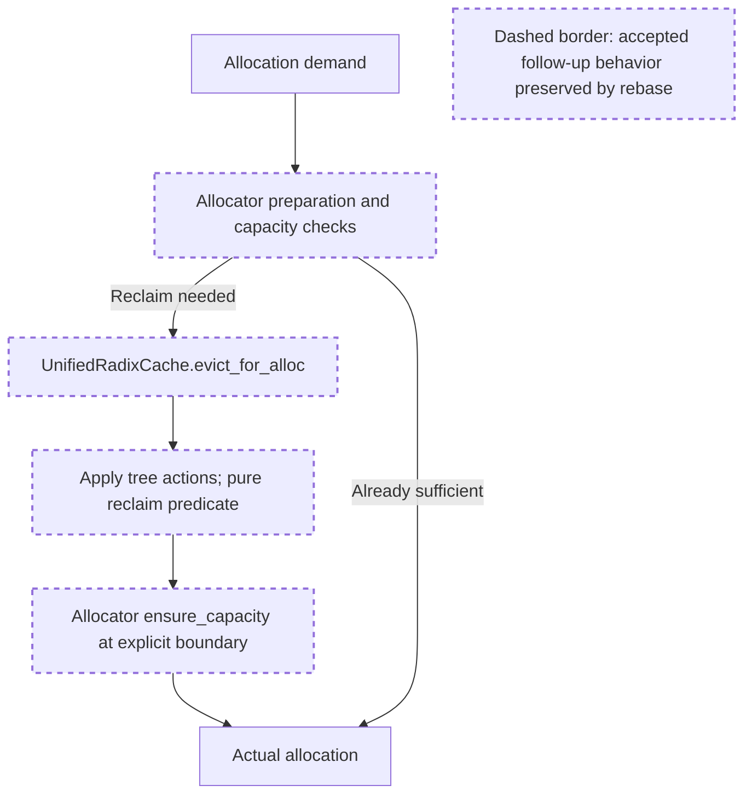

# PR39294 rebased candidate acceptance — 2026-09-15

The candidate replays the previously accepted allocator/cache follow-ups onto the combined latest-fetched PR36729 and main. The four patches are unchanged. Their runtime contract remains allocator-owned feasibility and bounded recovery, with pure reclaim predicates inside the cache walk. Incoming session/request-attempt interfaces and the Rust event binding coexist with these changes.

Preparation occurs outside the victim callback. Eviction actions can free multiple components, and the pure predicate can stop further eviction as soon as its sufficient condition holds. The allocator then performs the certified recovery and checks actual capacity. The rebase adds no further production or test changes to this accepted behavior.

Historical review synthesis: the full 40,110-episode sweep matched 2,208 memory/cache-related threads across 802 PRs for the affected path groups; a separate sweep matched 306 unified-cache conversations across 306 PRs. The relevant recurring concerns are mutation ownership, compatibility across cache implementations and focused lifecycle regression tests. [PR23678](https://github.com/sgl-project/sglang/pull/23678#discussion_r3193531781) and [PR31902](https://github.com/sgl-project/sglang/pull/31902#issuecomment-5032343239) informed these checks. Current source and submitted evidence, rather than historical precedent alone, determine this disposition.

**Decision: APPROVED for local review branch adoption, with historical limitations preserved.** No mandatory source correction or additional experiment is required for this bounded integration checkpoint. This closes the final local-adoption checkpoint in REBASE_PLAN_REVIEW.md.

Reviewed identity:

| Item | Commit / SHA256 |
| --- | --- |
| Candidate HEAD | `276f389f0410a5ddc57fe71a5ea40fb13bf25c66` |
| Candidate tree | `d8f56aeb88c02a056f8defe4b8f47c68f6c777bf` |
| Combined base | `0b1065a618f09f7fe04d00ceaeeb73ef8067af0f` |
| Base first parent, PR36729 | `a6eb82dc77353249fff1b08356533c2dc16ea6ec` |
| Base second parent, main | `832ec39cc0324cb0e7823dc8385e27a30c356bdd` |
| REBASE_RESULTS.md SHA256 | `eda3eafe088ca7245b5e2e1ddd8d85e4f5561081ded39eebcd9d6f9da904f324` |
| candidate-manifest.json SHA256 | `01d8fbfae2c6fb37caf65c2413c0eb8ddb8f88ec2b9b3a734e046ab12bd34b4b` |
| candidate.patch SHA256 | `eb2bb7e7f0b6a0c5b7512a37572a893a6529464b16e128c320b1383e4abd91e4` |

Static verification completed:

- HEAD, tree, base parents and clean working-tree status agree with the report. An independent range-diff confirms all four entries are `=`: `7b98cd9a86 -> 95c4989210`, `899fe03521 -> 2cbee5ec44`, `c3903a5be8 -> a62664863b`, and `68a70f6cc8 -> 276f389f04`. The production diff was inspected against the combined base; it preserves the accepted exact extend-demand hook, cumulative callback quota mode, wrapper forwarding, END/HIGH recovery and FLOAT gates.
- All manifest hashes match: 10 source/test files, 22 Rust package files and 41 evidence artifacts. The loaded Rust binary also matches its separately recorded SHA256, `3db28452350c9ee0f5db36f56fae5234237e6cabd864a3383b386e312268ec88`. The recorded binding signature includes `session_id`; the integrated adapter and binding consume the matching insertion/event interface.
- The backup branch and local review branch still point to `68a70f6cc8ca174dd75606723424b210cb664ed3`; the local remote-tracking archive ref also remains there. Remote state was not queried or mutated by this review.
- The configurator probe invokes real budget configuration, token constraints, size derivation and the SWA pool factory. It checks the 6,144-byte uncapped remainder and the capped/speculative/draft envelopes. Its runner fixture is not end-to-end serving validation.
- The attempt probe exercises real cache/StreamingSession forwarding and isolates two handles sharing a rid in the tested accounting maps. The row-coalescing test frees adjacent ranges split inside an eight-token page and retains rejection of nonadjacent overlapping-page frees. These are focused compatibility checks, not exhaustive prefetch concurrency coverage.
- Each GPU harness differs from its previously accepted version only by removing top-level invocations: event/graph cases, superseded gate/pending cases or pending-reader diagnostics. Assertions and helper implementations remain unchanged. New provenance points to this candidate worktree. This is valid allocation/data/gate evidence without upgrading omitted ordering coverage.
- The pre-commit hook reads GITHUB_BASE_REF and falls back from `origin/<base>` to `<base>`. The reported `upstream/main` resolves to pinned `832ec39cc0`, which is an ancestor of this candidate. The corrected comparison base is appropriate; it is not a hook bypass. The clean tree and final hook log support the reported no-edit outcome.

Accepted submitted results, reviewed from logs rather than rerun:

| Lane | Result |
| --- | --- |
| Existing 13 CPU files | 276 passed; 1,597 subtests; 10 GPU skips |
| Real Rust joint/tri/gate and upstream integration | 141 passed; 138 subtests; 1 skip; 2 deselected |
| Upstream compatibility CPU | 56 passed; 7 subtests |
| Python session metadata | 2 passed; 2,613 deselected |
| Same-rid attempt probe | PASS for the asserted lifecycle forwarding/accounting behavior |
| Real configurator/factory probe | 4 PASS |
| RTX5090 allocation/data/paged/gate controls | 19 PASS: 6 tri, 8 two-pool, 2 paged tri, 3 independent gates |
| Correct-base all-files pre-commit | PASS |

The Rust adapter still explicitly rejects session-radix-cache, so the two session-cursor exclusions remain justified; session metadata support does not remove that restriction. The upstream Rust integration file retains a CUDA-required skip. These results must retain their skips/exclusions, and overlapping lanes must not be summed into a unique test count. Exploratory fixture failures and the interrupted broad device-fixture run remain historical logs, not successful evidence or demonstrated production regressions.

Authorized next actions: adopt the exact candidate as the clean local `review/pr39294-unified-joint-allocation` branch/worktree, preserving the backup, frozen candidates, published PR branch, remote archive and unrelated worktrees. Verify the branch still has the expected old HEAD and no uncommitted work before moving it. A local non-fast-forward move is expected after this rebase and is approved. Append current integration status/results and an unchanged copy of this decision as documentation; retain old manifests/reviews as historical records. Any documentation commit should identify `276f389f0410a5ddc57fe71a5ea40fb13bf25c66` as the tested code candidate. Use the actual absolute CPU runner path in the new command record instead of the report's illustrative relative spelling. Documentation-only additions do not require another allocator experiment.

Preserved limits: this approval does not establish complete FLOAT recoverability, real asynchronous lazy-writer ordering or pending-reader reuse safety beyond the previously documented evidence. Their historical INCONCLUSIVE results remain INCONCLUSIVE; no delay-forcing rerun is required for this checkpoint. Earlier eager ordering and graph results remain historical, and the new 19 controls do not constitute new graph or overlap validation. Serving/model accuracy/performance, complete DCP/DSV4/distributed coverage, CI, C3 author agreement and PR merge readiness remain outstanding or outside this checkpoint. PR36729 is the supplied OPEN head, not a verified landed baseline; its eventual merged commit and remaining delta must be checked again.

No push, force-push, PR reply, new PR, remote merge or new production synchronization work is authorized by this decision. This reviewer performed static inspection and hash checks only, wrote this acceptance artifact, and did not implement, run tests/builds/GPU workloads, or modify source.
