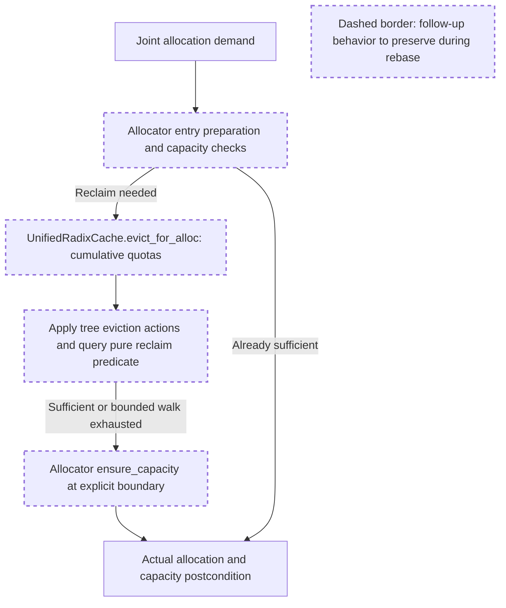

# PR39294 local rebase plan review — 2026-09-15

This review covers the pinned local integration plan, not a completed integration or a PR merge decision. Only static source/history inspection, supplied evidence inspection and hash verification were performed. No implementation, merges, rebases, tests, builds, GPU workloads or remote actions were performed by this reviewer.

The addendum combines latest-fetched PR36729 and main as the new base, then replays only the four follow-up commits from the archival review branch. At runtime, the preserved follow-up code makes allocation reclaim stop on a pure sufficient condition and performs recovery at explicit allocator boundaries. Incoming main independently changes request-attempt identity, session metadata, row release and Rust interfaces; a clean textual replay cannot establish their compatibility.

The allocator prepares before reclaim. During eviction, applied actions can free several components; the pure predicate observes that progress without moving payloads. Recovery and actual allocation remain outside the victim callback. The rebase must retain this contract while preserving the incoming lifecycle interfaces.

Historical review synthesis: a complete 40,110-episode corpus sweep over memory/cache, manager, session, Rust, test and documentation paths matched 2,894 threads across 1,023 PRs. A separate non-inline unified-cache sweep matched 306 conversations across 306 PRs. Relevant recurring concerns are ownership of mutations, compatibility with other cache implementations, and focused lifecycle regressions. The ownership and HiCache compatibility discussion in [PR23678](https://github.com/sgl-project/sglang/pull/23678#discussion_r3193531781), and the narrow prefetch-lifecycle fix with regression coverage in [PR31902](https://github.com/sgl-project/sglang/pull/31902#issuecomment-5032343239), support checking real interfaces and affected callers rather than treating a conflict-free merge as validation. Historical evidence informs this review; it does not establish correctness of the new candidate.

**Decision: APPROVED for implementation and validation, subject to the concrete conditions below.** No revised plan or additional approval is required to start work within this scope. REBASE_ADDENDUM.md supersedes the merge-only ordering and fast-forward adoption language in SYNC_PLAN.md. There is no blocking objection to the proposed architecture or rebase sequence.

Reviewed immutable inputs:

| Input | SHA256 or commit |
| --- | --- |
| SYNC_PLAN.md | `0717c22471b1e175e10b8d108918c6eb591f26f7ea0873b771efeb91c26d46dc` |
| REBASE_ADDENDUM.md | `3fb4423e5bd5dcb754b770f266209b3d2af82c13d132b3d97e73444b2f7bdef9` |
| refs.json SHA256 | `3a7259fdd5f51a5de6066ea12a2b980dda920c12359afc525c118cb2da2fd5a0` |
| Archival review HEAD | `68a70f6cc8ca174dd75606723424b210cb664ed3` |
| Old follow-up base | `6c8bbdf610fae5a3ddba826162bc7ca91e79dbfb` |
| Latest-fetched PR36729 | `a6eb82dc77353249fff1b08356533c2dc16ea6ec` |
| Latest-fetched main | `832ec39cc0324cb0e7823dc8385e27a30c356bdd` |
| Published PR39294, preserved | `276771eefca951ae6d55608415f2d795cbfabdae` |

“Latest” here means the supplied fetched snapshot, not an independently refreshed remote head. The old-base-to-review range was independently confirmed to contain exactly `7b98cd9a8693581d95b981b8bc48ffae404c9ae2`, `899fe03521d208cb118ef725334b5bae8774185f`, `c3903a5be81e1af075b240d17f15b1b7b9785ee9`, and `68a70f6cc8ca174dd75606723424b210cb664ed3`.

1. **Approved Git operations.** Preserve a local backup pointing to the archival HEAD. In isolated worktrees/branches, merge pinned main into pinned latest36729, then rebase only the four listed follow-ups onto that combined base. Use an explicit old-base boundary; a generic rebase that replays the other author's stack is outside this approval. Inspect the resulting ancestry and complete combined diff, including cleanly applied changes. Pairwise merge-tree logs are useful preliminary evidence only. Keep frozen candidates, the published PR branch, unrelated worktrees and the remote archive unchanged. Updating the local archival branch remains contingent on final candidate review; a rebased result need not be its fast-forward descendant. No push, force-push, PR message, new PR or remote merge is authorized here.

2. **Approved integration fixes.** Resolve concrete conflicts and demonstrated interface/regression failures in the affected allocator/cache/caller/test paths. Preserve upstream request-attempt handles, session ownership and row-free coalescing alongside the accepted planner, exact extend-demand hook, cumulative reclaim quotas, cascade accounting, pure predicates, physical-capacity/virtual-ID distinction, bounded tri preparation, END/HIGH sufficient recovery and independent movement gates. Do not restore per-victim preparation, nominal capacity caps or whole-file older implementations to make conflicts disappear. Material algorithm redesign or new production synchronization changes still require a supplemental plan.

3. **Required CPU compatibility coverage.** Rerun the previous 13-file lane against the integrated source, preserving its substantive assertions if upstream moved tests or changed required fixture interfaces. Retain exact95 retention and 1/1/1 cascade checks, impossible-request preservation, exact extend rounding, asymmetric virtual-ID bounds, pure callback snapshots, controller progress without a returned node, independent gates, and strict retained KV/conv/temporal payload checks. Run affected upstream unified radix, streaming-session/request-attempt and row-release tests. In particular, cover distinct attempts sharing a rid, correct abort/finish forwarding and session metadata, and adjacent row-release ranges whose seam lies inside a page greater than one. Existing upstream tests may satisfy these requirements; add focused tests only for uncovered integration behavior. Do not weaken assertions or suppress newly failing cases to reproduce historical totals.

4. **Rust provenance is required, not an optional import check.** Pinned main changes `InsertParamsBinding` to accept `session_id` and extends the `block_stored` tagged tuple to carry it at index 7; the Python adapter consumes both changes. Build the integrated radix extension locally unless matching build provenance already proves the loaded binary includes these interfaces. Record the loaded extension path and build/source provenance. Run the real Rust joint/tri/gate and affected integration lane, including insertion and event conversion. Python fallback is not Rust coverage. Reassess the two historical session-cursor exclusions against the new supported contract; neither silently preserve exclusions nor assume session event metadata implies session-cursor support.

5. **Byte-budget selection.** Validate the actual configurator path for an uncapped, non-speculative pool retaining the profiled rounding remainder and for capped/draft/speculative paths retaining their intended envelope. Inspect how `unified_total_bytes` reaches `_init_unified_swa_pools`, not just its final conditional. A focused test invoking the real configuration logic is approved if existing tests miss this distinction; duplicating the conditional in a test helper is insufficient. Do not change admission/reporting semantics as an incidental integration fix.

6. **Bounded validation authorization.** The stated CPU tests, necessary local Rust build, static/format checks and all-files pre-commit are approved. Inspect any automatic edits and keep unrelated cleanup out of the candidate. If CUDA is available, rerun the already corrected allocation/data, paged and allocation-inclusive independent-gate controls sequentially, one process at a time, with at least 4 GiB free, fixtures below 1 GiB and an external 180-second timeout per process. Selection/adaptation of accepted harness cases to the integrated interfaces is allowed; retain their assertions and record the exact scripts and hashes. Do not resurrect superseded writer/gate fixtures. Stop on CUDA errors, timeouts, retention or payload failures and report them. No model downloads, serving, performance experiments or production workaround is approved.

7. **Existing overlap limits remain explicit.** Do not repeat delay-forcing probes. Prior lazy-writer ordering and pending-reader GPU results remain INCONCLUSIVE, and historical eager ordering evidence does not become new integrated-tree evidence. GPU unavailability must be reported as NOT_RUN, not PASS. These limits do not block starting this bounded integration/test plan; final acceptance will assess the actual results without claiming complete asynchronous, DCP/DSV4 end-to-end or serving coverage.

8. **Final review submission.** Supply the combined-base commit and parents, old-to-new mapping/range-diff for the four replayed commits, separately identified integration fixes, final candidate HEAD/tree, complete diff from the combined base, clean/dirty status and hashes of source/test artifacts. Tie all new logs, commands, exclusions and test counts to that exact source and loaded extension. Preserve old manifests and reviews as historical records; append current integration evidence separately. Submit any post-validation code changes for appropriate revalidation. PR36729 is an OPEN pinned head in this plan; when it actually merges, verify its landed commit and remaining delta again. C3 coordination, CI and PR merge readiness remain separate outstanding decisions.

Artifact placement: the requested results directory is read-only under this review session's current filesystem policy. This complete review is therefore saved as `/tmp/REBASE_PLAN_REVIEW.md`. Its decision applies to the input hashes above regardless of where an authorized session subsequently stores an unchanged copy.
